# 시퀀스 다이어그램 — Slim P0

> 본 문서는 `01-requirements.md`의 요구사항을 기반으로,
> 각 도메인별 핵심 유스케이스의 **책임 분리**, **호출 순서**, **트랜잭션 경계**를 시퀀스 다이어그램으로 검증한다.

> **예외 면책 조항**: 본 문서의 예외(Exception)는 확정된 것이 아닌, 흐름 이해를 위한 대략적인 예외입니다. 실제 구현 시 ErrorType과 HTTP 상태 코드는 변경될 수 있습니다.
>
> **문서 상태**
> - 성격: 초기 설계/보조 자료
> - 현재 구현 단일 기준이 아니다
> - 본문에 등장하는 EventPublisher / EventListener 기반 정리 흐름은 후속 TODO가 포함되어 있다
> - 현재 구현 판단은 `docs/design/01-requirements.md`, `CLAUDE.md`, 실제 코드 우선

---

## 목차

1. [문제 상황 재해석](#1-문제-상황-재해석)
2. [BC 경계 정의 및 레이어 규칙](#2-bc-경계-정의-및-레이어-규칙)
3. [삭제 정책](#3-삭제-정책)
4. [다이어그램 범례](#4-다이어그램-범례)
5. [Catalog BC — Brand](#5-catalog-bc--brand)
    - 5-1. 브랜드 목록 조회 (GUEST/USER) — VISIBLE만 조회
    - 5-2. 브랜드 상세 조회 (GUEST/USER) — VISIBLE만 조회
    - 5-3. 브랜드 등록 (ADMIN) — 기본 HIDDEN
    - 5-4. 브랜드 수정 (ADMIN) — visibleStatus 선택적 변경
    - 5-5. 브랜드 삭제 (ADMIN) — 삭제 정책 포함
    - 5-6. 브랜드 목록 조회 (ADMIN) — visibleStatus 필터
    - 5-7. 브랜드 상세 조회 (ADMIN) — HIDDEN 포함
    - 5-8. 브랜드 노출 상태 변경 (ADMIN) — PATCH
6. [Catalog BC — Product](#6-catalog-bc--product)
    - 6-1. 상품 목록 조회 (GUEST/USER)
    - 6-2. 상품 상세 조회 (GUEST/USER)
    - 6-3. 상품 등록 (ADMIN)
    - 6-4. 상품 수정 (ADMIN)
    - 6-5. 상품 삭제 (ADMIN)
7. [Like BC](#7-like-bc)
    - 7-1. 좋아요 등록 (USER) — 상품/브랜드 공통
    - 7-2. 좋아요 취소 (USER)
    - 7-3. 좋아요 목록 조회 (USER)
    - 7-4. 이벤트 핸들러 — 대상 삭제 시 좋아요 정리
8. [Cart BC](#8-cart-bc)
    - 8-1. 장바구니 담기 (USER)
    - 8-2. 장바구니 조회 (USER)
    - 8-3. 장바구니 수량 변경 (USER)
    - 8-4. 장바구니 항목 삭제 (USER)
    - 8-5. 주문 대상 선택 (USER)
    - 8-6. 장바구니 상태 확인 (USER)
    - 8-7. 이벤트 핸들러 — 주문 완료 / 상품 삭제 시 CartItem 정리
9. [Order BC](#9-order-bc)
    - 9-1. 주문 생성 (USER) — 재고 차감 + 스냅샷 + 멱등 키
    - 9-2. 주문 목록 조회 (USER)
    - 9-3. 주문 상세 조회 (USER)
    - 9-4. 주문 목록 조회 (ADMIN)
    - 9-5. 주문 상세 조회 (ADMIN)
10. [설계 포인트 요약](#10-설계-포인트-요약)

---

## 1. 문제 상황 재해석

### 사용자 관점
- GUEST는 카탈로그를 빠르게 탐색해야 한다.
- USER는 탐색 이후 좋아요, 장바구니, 주문까지 끊김 없이 이어져야 한다.
- ADMIN은 브랜드/상품 운영 중 삭제 정책을 실수 없이 지켜야 한다.

### 비즈니스 관점
- 주문 생성 시 재고 차감과 주문 스냅샷 저장이 원자적으로 보장되어야 한다.
- 상품 삭제는 허용하되, 브랜드 삭제는 "활성 상품 0개" 정책을 반드시 지켜야 한다.
- 주문 이력 조회는 상품 삭제 여부와 무관하게 스냅샷으로 유지되어야 한다.

### 시스템 관점
- Query와 Command를 분리해 조회 성능과 변경 안정성을 확보해야 한다.
- 인증/인가, 소유권 검증, 정책 검증 책임이 섞이지 않도록 경계를 명확히 해야 한다.
- 실패 지점(재고 부족, 정책 위반, 동시성 충돌)을 일관된 예외 규약으로 다뤄야 한다.

---

## 2. BC 경계 정의 및 레이어 규칙

### 2.1 Bounded Context 구조

| BC | 패키지 | Sub-domain |
|---|---|---|
| User | `com.loopers.user/` | user |
| Catalog | `com.loopers.catalog/` | brand, product |
| Like | `com.loopers.like/` | like |
| Cart | `com.loopers.cart/` | cart |
| Order | `com.loopers.order/` | order |

### Cross-BC Port 목록

| Port Interface | 위치 | 용도 |
|---|---|---|
| `LikeTargetValidator` | `like/application/port/` | Product/Brand 존재 검증 |
| `CartProductReader` | `cart/application/port/` | Product 정보 조회 |
| `OrderCartItemReader` | `order/application/port/` | Cart 항목 조회 |
| `OrderProductReader` | `order/application/port/` | Product 정보 조회 |
| `OrderStockManager` | `order/application/port/` | 재고 차감 |

### 2.2 레이어 규칙

1. **Facade는 Service만 호출한다.** Port, Repository, DomainService 등을 직접 호출하지 않는다.
2. **Service가 모든 외부 호출의 주체다.** Repository/Port(Cross-BC)는 Service에서 호출하고, 정책 판정은 Domain Model/DomainService로 위임한다.
3. **호출 순서**: Controller → Facade → Service → (Repository / Port / Domain Model / DomainService). 계층 건너뛰기 금지.
4. **Cross-BC 동기 호출은 `Service -> Port -> ACL -> Provider Facade`로 고정한다.**
5. **ACL은 thin adapter다.** 변환/단순 위임만 수행하며 비즈니스/오케스트레이션/에러 매핑 로직을 두지 않는다.
6. **ACL에서 Provider Repository/JPA/QueryDSL 직접 호출을 금지한다.**
7. **Service의 public 메서드는 유스케이스 계약과 Facade/EventListener가 조합하는 단계를 노출한다.** 클래스 내부 전용 helper는 private으로 관리한다.
8. **DomainService는 Repository/Port를 호출하지 않는다.** 다중 Aggregate 협력 중재가 필요할 때만 Service가 데이터를 전달해 호출한다.
9. **Domain Model은 순수 비즈니스 로직만 포함한다.** 외부 의존(Repository, Port, Spring 등) 없음.

### 2.3 Cross-BC 통신 패턴

| 패턴 | 사용 조건 | 예시 |
|---|---|---|
| **동기 Port + ACL + Provider Facade** | 응답 데이터가 현재 트랜잭션에 필요하거나, 검증 실패 시 즉시 에러 반환이 필요한 경우 | LikeTargetValidator, CartProductReader, OrderStockManager |
| **도메인 이벤트** | 후속 처리/정리 작업으로, 실패해도 원래 트랜잭션에 영향 없는 경우 (최종 일관성) | OrderCreatedEvent, ProductDeletedEvent |

### 도메인 이벤트 목록

| 이벤트 | 발행 BC | 구독 BC | 처리 내용 |
|---|---|---|---|
| `OrderCreatedEvent` | Order | Cart | userId, cartItemIds → 장바구니 항목 Hard Delete |
| `ProductDeletedEvent` | Catalog | Cart, Like | productId → Cart: 해당 상품 CartItem Hard Delete / Like: 해당 상품 Like Hard Delete |
| `BrandDeletedEvent` | Catalog | Like | brandId → 해당 브랜드 Like Hard Delete |

---

## 3. 삭제 정책

| Domain | Delete 방식 | 근거 |
|---|---|---|
| Brand | Soft Delete | 상품 참조, 이력 보존. `BaseEntity.deletedAt` |
| Product | Soft Delete | 주문 스냅샷 참조 가능성. `BaseEntity.deletedAt` |
| Like | Hard Delete | 이력 불필요, 타 도메인 미참조 |
| CartItem | Hard Delete | 임시 데이터, 주문 후 가치 없음 |
| Order | 삭제 불가 (P0) | 영구 기록, 삭제 API 없음 |
| OrderItem | 삭제 불가 (P0) | Order에 종속 |
| User | Soft Delete (향후) | 현재 삭제 API 없음 |

---

## 4. 다이어그램 범례

| 참여자 접두사 | 의미 |
|---|---|
| `Controller` | 프레젠테이션 레이어. Request 수신, Response 반환 |
| `Facade` | 유스케이스 오케스트레이션. **트랜잭션 경계. Service만 호출** |
| `Service` | **Repository/Port를 호출하는 유일한 레이어.** 정책 판정은 Domain Model/DomainService에 위임. public은 유스케이스 계약만 노출 |
| `DomainModel` | 도메인 모델(Aggregate Root). 불변식 검증, 상태 변경 |
| `DomainService` | 다중 Aggregate 협력 중재 규칙 (순수 Java). **Repository/Port 호출 금지** |
| `Repository` | 영속성 추상화 (CQRS: Command/Query 분리) |
| `Port` | Cross-BC 통신 인터페이스 **(Service에서만 호출)** |
| `ACL` | Port 구현체. **Provider Facade 호출만 허용**, 변환/위임만 수행 (에러 매핑은 호출 Service 책임) |
| `Event` | 도메인 이벤트 발행. **트랜잭션 커밋 후 비동기 전달** (최종 일관성) |
| `EventListener` | 도메인 이벤트 구독. **별도 트랜잭션**에서 후속 처리 |

---

## 5. Catalog BC — Brand

### 5-1. 브랜드 목록 조회 (GUEST/USER) — VISIBLE만 조회

**왜 필요한가**: 비회원도 접근 가능한 조회 API로, VISIBLE 상태의 브랜드만 노출되는지 확인한다.
**검증 포인트**: 인증 미요구, readOnly 트랜잭션, **VISIBLE 필터 고정**, 페이지네이션 처리 위치.

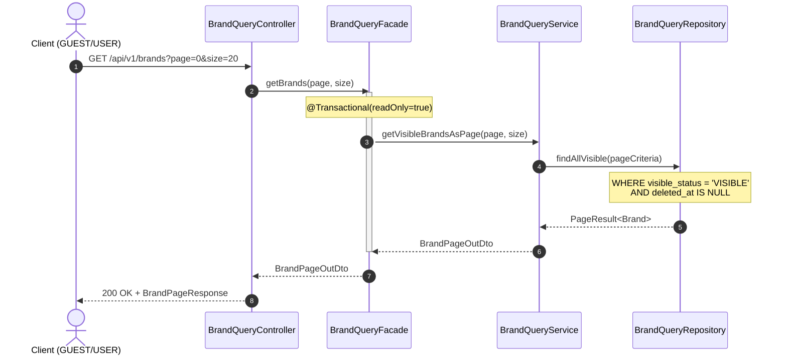

**해석**:
- 인증 헤더가 불필요하므로 Facade에서 HeaderValidator 호출이 없다.
- `readOnly=true` 트랜잭션으로 DB 부하를 최소화한다.
- **VISIBLE 상태의 브랜드만 조회**: Repository에서 `visible_status = 'VISIBLE'` 고정 필터를 적용한다.
- HIDDEN 브랜드는 목록에 노출되지 않는다.

---

### 5-2. 브랜드 상세 조회 (GUEST/USER) — VISIBLE만 조회

**왜 필요한가**: 단건 조회에서 VISIBLE 상태만 조회 가능하며, HIDDEN 브랜드는 404로 처리되는지 확인한다.
**검증 포인트**: **VISIBLE 필터 적용**, 404 예외 발생 지점, 예외 전파 경로.

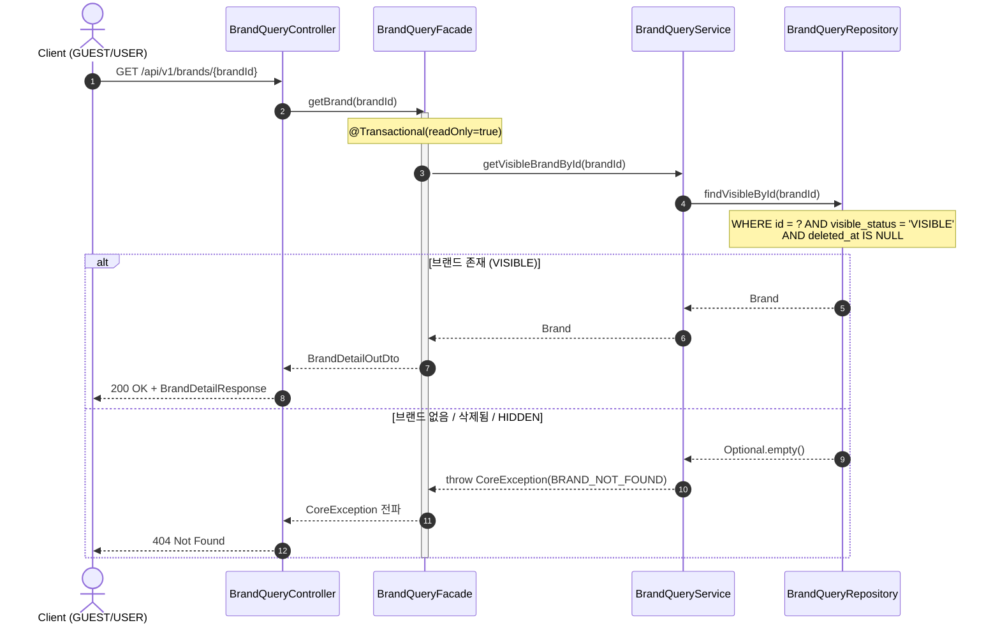

**해석**:
- `BRAND_NOT_FOUND` 예외는 **Service 레이어**에서 발생한다. Repository는 Optional만 반환하고, 존재 여부 판단은 Service의 책임이다.
- **HIDDEN 브랜드도 404로 처리**한다. User/Guest에게 HIDDEN 브랜드의 존재 여부가 노출되지 않는다.
- Soft Delete된 브랜드도 동일하게 404로 처리한다.

---

### 5-3. 브랜드 등록 (ADMIN) — 기본 HIDDEN

**왜 필요한가**: ADMIN 인증 + Command 흐름에서 도메인 모델의 팩토리 메서드 호출과 트랜잭션 경계를 확인한다.
**검증 포인트**: LDAP 인증 검증 지점, Brand.create() 유효성 검증, **기본 visibleStatus = HIDDEN**, 트랜잭션 범위.

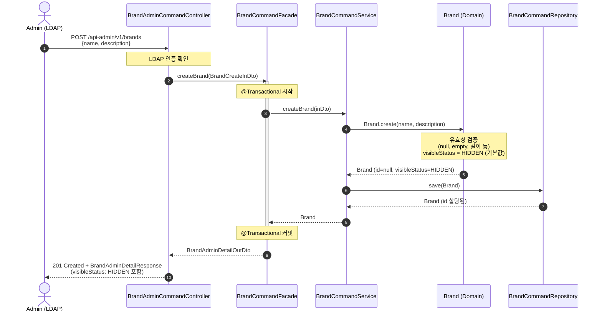

**해석**:
- LDAP 인증은 Controller(또는 Filter/Interceptor) 레벨에서 선행된다.
- `Brand.create()`에서 유효성 검증이 수행되며, **visibleStatus는 기본값 HIDDEN**으로 설정된다.
- 관리자가 명시적으로 VISIBLE로 변경해야 User/Guest에게 노출된다.
- 응답에 `visibleStatus` 필드가 포함된다 (Admin 전용 DTO 사용).
- 트랜잭션 경계는 Facade에서 관리한다.

---

### 5-4. 브랜드 수정 (ADMIN) — visibleStatus 선택적 변경

**왜 필요한가**: 기존 엔티티 조회 → 도메인 상태 변경 → 저장 흐름에서 visibleStatus 선택적 변경이 어떻게 처리되는지 확인한다.
**검증 포인트**: "조회 후 수정" 패턴, **visibleStatus null이면 변경 없음**, 동시성 충돌(낙관적 락) 발생 지점.

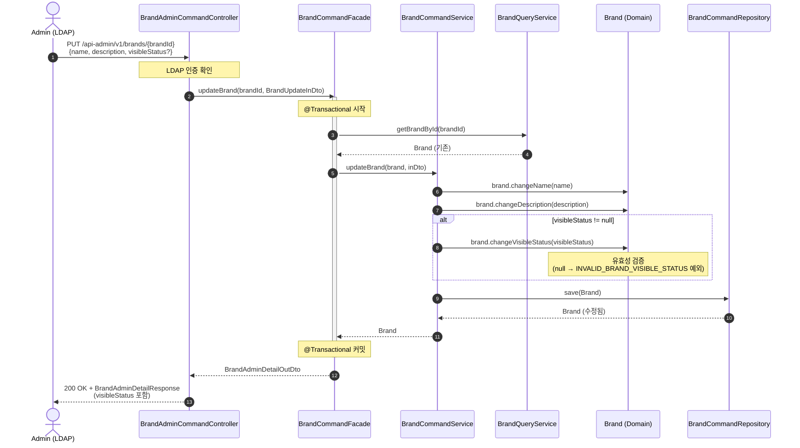

**해석**:
- 조회(Query)와 수정(Command) Service가 분리되어 있으므로, Facade에서 두 Service를 조합한다.
- 도메인 모델의 `changeXxx()` 메서드가 유효성 검증을 수행한다.
- **`visibleStatus`가 null이면 변경하지 않음**: PUT 요청에서 visibleStatus를 생략하면 기존 값 유지.
- 동시성 충돌 시 409 Conflict가 발생할 수 있다 (낙관적 락 적용 시).

---

### 5-5. 브랜드 삭제 (ADMIN) — 삭제 정책 포함

**왜 필요한가**: P0의 핵심 삭제 정책("활성 상품 0개")이 **어디서**, **어떤 책임 객체가** 검증하는지를 확인한다. 이것이 가장 중요한 비즈니스 규칙 중 하나다.
**검증 포인트**: 삭제 정책의 판정 소유권(Entity vs DomainService), Service의 facts 조회/전달, 트랜잭션 범위.

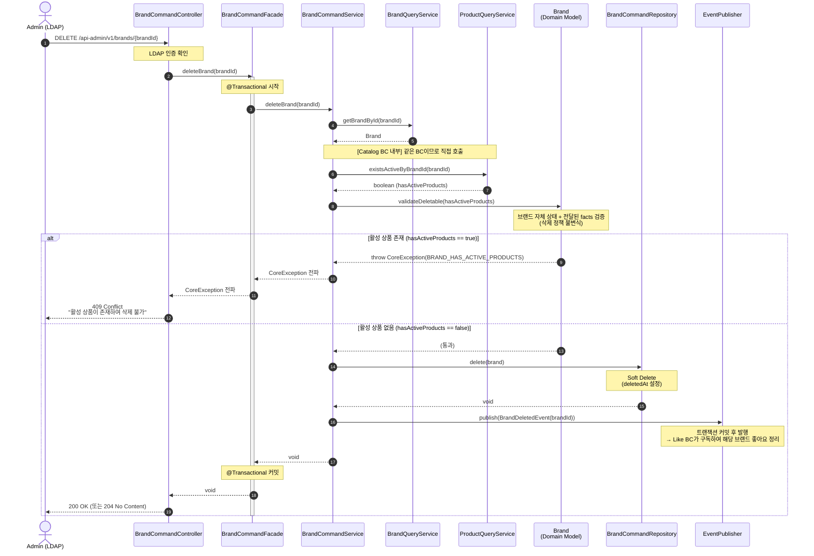

**해석**:
- **Facade는 Service만 호출**한다. Facade에서 Domain Model/DomainService를 직접 호출하지 않는다.
- **Service가 데이터 조회 → Domain Model에 facts 전달** 패턴: `BrandCommandService`가 `ProductQueryService.existsActiveByBrandId()`를 호출하고, 그 결과(`boolean`)를 `Brand.validateDeletable(hasActiveProducts)`에 전달한다.
- 삭제 정책의 1차 판정 소유권은 Brand(Entity)에 둔다. 규칙이 다중 Aggregate 협력 중재로 확장되면 `BrandDeleteValidator` DomainService로 승격한다.
- Brand와 Product는 **같은 Catalog BC** 내부이므로, Service 간 직접 호출이 허용된다.
- Soft Delete로 `deletedAt`을 설정하므로, 이후 조회에서 자동 필터링된다.
- **BrandDeletedEvent**: 삭제 성공 후 이벤트를 발행하여, Like BC가 해당 브랜드의 좋아요를 정리한다 (최종 일관성).

---

### 5-6. 브랜드 목록 조회 (ADMIN) — visibleStatus 필터

**왜 필요한가**: 관리자는 HIDDEN 포함 모든 브랜드를 조회할 수 있으며, 선택적으로 노출 상태 필터를 적용할 수 있다.
**검증 포인트**: visibleStatus null이면 전체 조회, 값이 있으면 필터, LDAP 인증 필수.

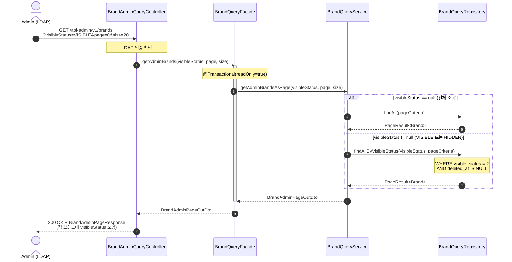

**해석**:
- LDAP 인증은 Controller에서 선행 검증한다.
- `visibleStatus` 파라미터가 null이면 전체 브랜드를 조회하고, 값이 있으면 해당 상태로 필터링한다.
- Admin 전용 DTO/Response를 사용하여 `visibleStatus` 필드가 응답에 포함된다.

---

### 5-7. 브랜드 상세 조회 (ADMIN) — HIDDEN 포함

**왜 필요한가**: 관리자는 HIDDEN 상태의 브랜드도 상세 조회할 수 있어야 한다.
**검증 포인트**: visibleStatus 필터 없이 조회, LDAP 인증 필수.

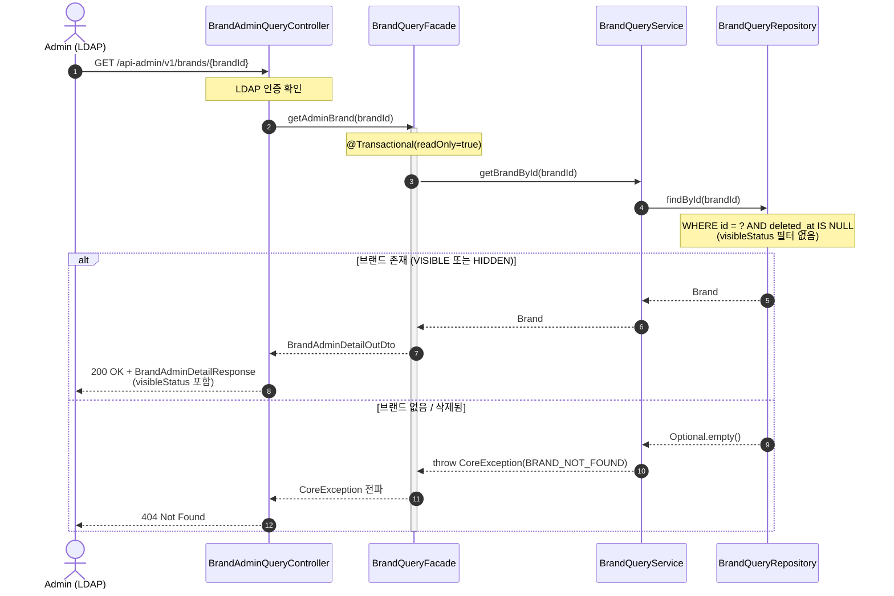

**해석**:
- 관리자는 HIDDEN 브랜드도 조회 가능하므로, `visibleStatus` 필터 없이 `findById()`를 사용한다.
- Admin 전용 DTO를 사용하여 응답에 `visibleStatus` 정보가 포함된다.

---

### 5-8. 브랜드 노출 상태 변경 (ADMIN) — PATCH

**왜 필요한가**: 브랜드의 노출 상태만 전용으로 변경하는 PATCH 엔드포인트의 흐름을 확인한다.
**검증 포인트**: LDAP 인증 필수, visibleStatus null → 400, changeVisibleStatus() 도메인 메서드 사용.

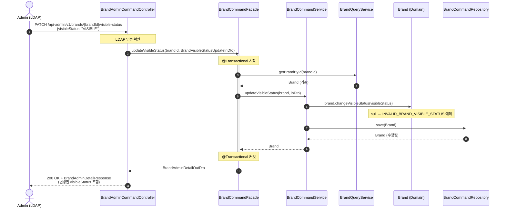

**해석**:
- PATCH 엔드포인트는 노출 상태만 전용으로 변경한다 (name, description 미변경).
- `changeVisibleStatus(null)` 시 도메인에서 `INVALID_BRAND_VISIBLE_STATUS` 예외가 발생한다.
- Request에서 `@NotNull` 검증이 선행되므로, null은 400으로 반환된다.

---

## 6. Catalog BC — Product

### 6-1. 상품 목록 조회 (GUEST/USER)

**왜 필요한가**: 브랜드 필터링과 정렬이 결합된 조회에서 파라미터 처리 흐름을 확인한다.
**검증 포인트**: brandId 필터, sort 파라미터 처리 위치, 페이지네이션.

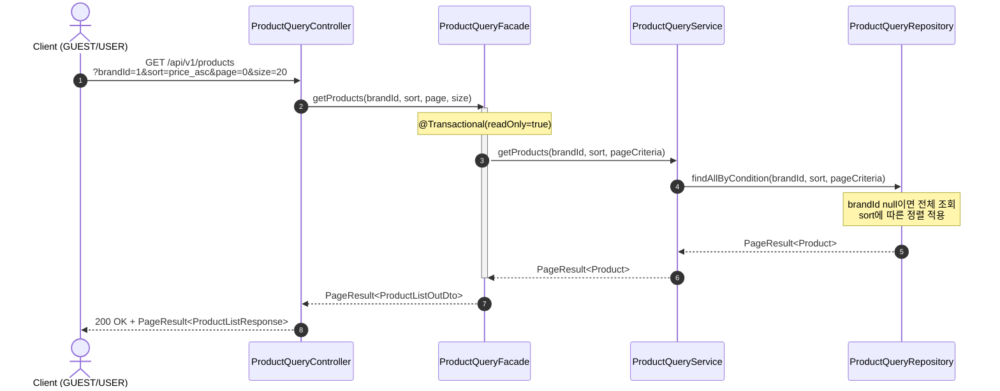

**해석**:
- `brandId`가 null이면 전체 상품, 값이 있으면 해당 브랜드의 상품만 필터링한다.
- 정렬 로직(`latest`, `price_asc`, `likes_desc`)은 Repository(QueryDSL)에서 처리한다.
- 삭제된 상품은 조회 결과에서 자동 제외된다.

---

### 6-2. 상품 상세 조회 (GUEST/USER)

**왜 필요한가**: 단건 조회로 6-2와 동일한 구조이므로 간략히 표현한다.
**검증 포인트**: 삭제된 상품 접근 시 404 반환.

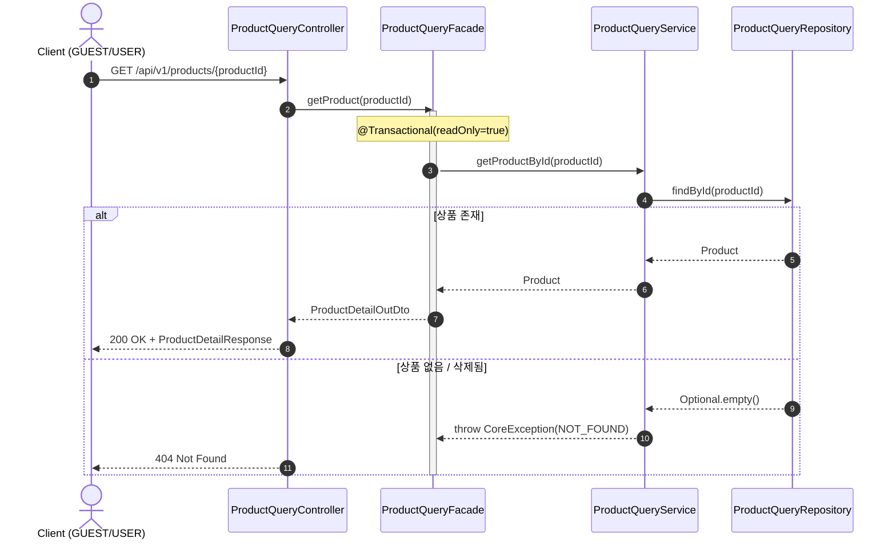

---

### 6-3. 상품 등록 (ADMIN)

**왜 필요한가**: 상품 등록 시 **브랜드 존재 여부 검증**(같은 Catalog BC 내부 참조)이 어디서 발생하는지 확인한다.
**검증 포인트**: 브랜드 참조 검증 주체, Product.create()의 유효성 검증 범위.

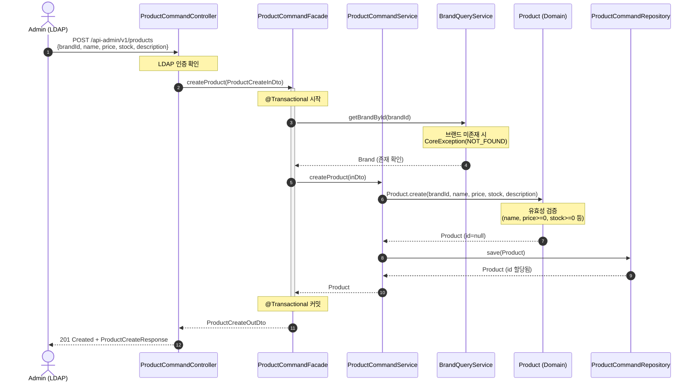

**해석**:
- **Facade는 Service만 호출**한다. 브랜드 존재 검증은 `ProductCommandFacade`가 `BrandQueryService`를 선호출하여 수행하고, 생성/저장은 `ProductCommandService`가 수행한다.
- Brand와 Product는 **같은 Catalog BC** 내부이므로, Facade에서 도메인 간 Service 조합이 허용된다.
- Product 도메인 모델은 `brandId`만 보유하며, Brand 도메인 객체에 직접 의존하지 않는다.
- 가격과 재고는 Product 생성 시 함께 설정된다 (P0에서는 옵션 없이 단일 가격/재고).

---

### 6-4. 상품 수정 (ADMIN)

**왜 필요한가**: "브랜드는 수정 불가" 정책이 어느 레이어에서 보장되는지 확인한다.
**검증 포인트**: 브랜드 변경 불가 정책 적용 위치.

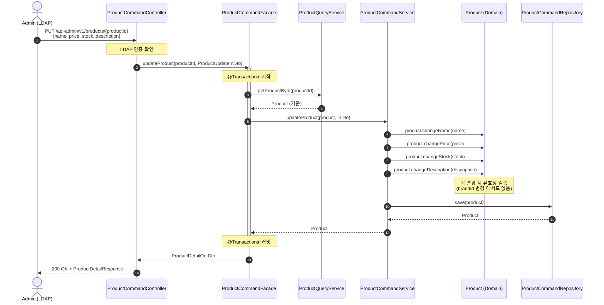

**해석**:
- "브랜드는 수정 불가" 정책은 **도메인 모델에 `changeBrandId()` 메서드가 없음**으로 보장된다. Request에 `brandId`가 포함되어도 무시된다.
- 이는 컴파일 타임에 보장되는 가장 강력한 제약이다.

---

### 6-5. 상품 삭제 (ADMIN)

**왜 필요한가**: P0 삭제 정책("주문 이력 존재해도 삭제 허용")에서 주문 스냅샷과의 관계를 확인한다.
**검증 포인트**: 삭제 조건이 브랜드 삭제보다 단순함, Soft Delete 적용.

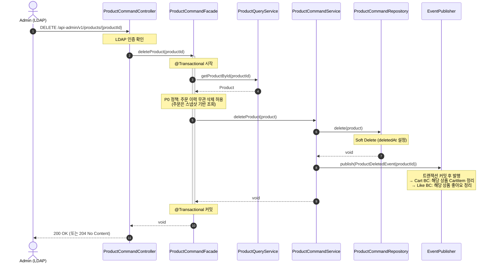

**해석**:
- P0에서는 주문 생성 직후 "거래 종료"로 간주하므로 **별도 삭제 조건 검증이 없다**.
- Soft Delete 후에도 주문 상세는 스냅샷 기반으로 조회 가능해야 한다.
- **ProductDeletedEvent**: 삭제 성공 후 이벤트를 발행하여, Cart BC가 해당 상품의 CartItem을, Like BC가 해당 상품의 좋아요를 정리한다 (최종 일관성).
- P2에서 주문 상태 확장 시, 삭제 조건 강화가 필요하다. 이때 판정 소유권이 다중 Aggregate 협력 중재로 커지면 `ProductDeleteValidator` DomainService 도입을 검토한다.

---

## 7. Like BC (ProductLike / BrandLike 분리)

> **설계 결정**: 좋아요는 `ProductLike`와 `BrandLike`로 도메인을 분리하여 각각 독립된 패키지(`engagement/productlike`, `engagement/brandlike`)로 구현한다.
> 통합 `Like` + `LikeTargetType` 방식 대비 타입 안전성, Cross-BC 의존 단순화, 독립 확장성에서 이점이 있다.

### 7-1. 상품 좋아요 등록 (USER)

**왜 필요한가**: 좋아요의 **멱등성 보장** 방식과, 대상 리소스 존재 검증의 책임을 확인한다.
**검증 포인트**: 멱등 처리 위치, Cross-BC(Product) 존재 검증에 Port 사용.

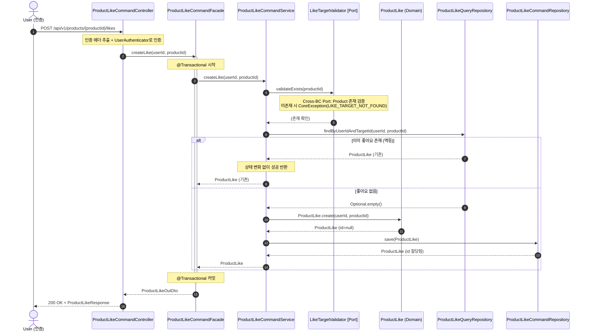

> BrandLike 등록도 동일한 흐름이다. `ProductLike` → `BrandLike`, `productId` → `brandId`로 치환.

**해석**:
- **Facade는 Service만 호출**한다. 모든 로직은 `ProductLikeCommandService` 내부에서 수행된다.
- **Cross-BC 존재 검증은 Port(`LikeTargetValidator`)를 통해** 수행한다. Like BC에서 Product BC의 Service를 직접 호출하지 않는다.
- **멱등성은 Service에서 "조회 후 판단"으로 보장**한다. 이미 좋아요가 있으면 재생성하지 않는다.

---

### 7-2. 상품 좋아요 취소 (USER)

**왜 필요한가**: 취소 시 좋아요가 없으면 404를 반환하는 정책을 확인한다.
**검증 포인트**: 비멱등 취소 처리 위치 (미존재 시 404).

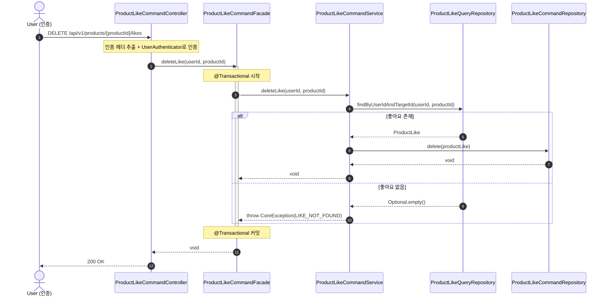

> BrandLike 취소도 동일한 흐름이다.

**해석**:
- 좋아요가 없는 상태에서 취소 요청이 오면 404를 반환한다 (삭제 API는 404 반환 정책).
- **Hard Delete**: 좋아요는 이력 보존이 불필요하므로 Hard Delete를 적용한다 (§3 삭제 정책 참조).

---

### 7-3. 좋아요 목록 조회 (USER) — ProductLike / BrandLike 분리

**왜 필요한가**: 상품 좋아요와 브랜드 좋아요가 별도 엔드포인트로 분리된 조회 흐름을 확인한다.
**검증 포인트**: 본인 리소스만 조회 보장, 분리된 엔드포인트.

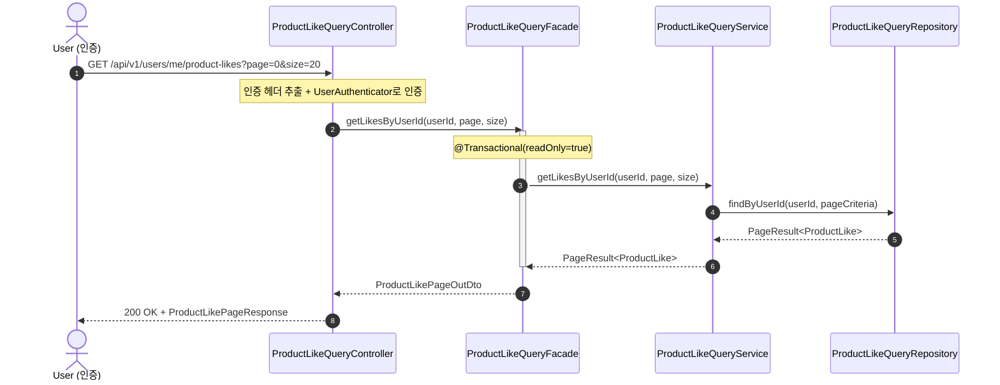

> BrandLike 목록 조회: `GET /api/v1/users/me/brand-likes?page=0&size=20` — 동일한 흐름.

**해석**:
- `userId`는 인증된 사용자의 ID로, **본인의 좋아요만 조회**된다 (소유권 보장).
- 기존의 `target` 파라미터 분기 대신 **엔드포인트 분리**로 타입 안전성을 확보한다.

---

### 7-3-1. 좋아요 여부 확인 (USER)

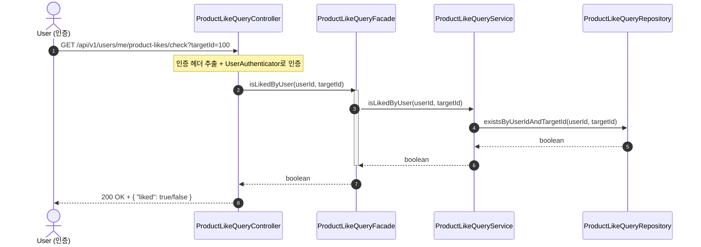

> BrandLike 여부 확인: `GET /api/v1/users/me/brand-likes/check?targetId=100` — 동일한 흐름.

---

### 7-4. 이벤트 핸들러 — 대상 삭제 시 좋아요 정리

**왜 필요한가**: 상품이나 브랜드가 삭제되면, 해당 대상에 대한 좋아요가 고아 데이터로 남는다. 이벤트 기반으로 정리하여 최종 일관성을 보장한다.
**검증 포인트**: 이벤트 구독 후 별도 트랜잭션 처리, Hard Delete 적용, 멱등 핸들러.

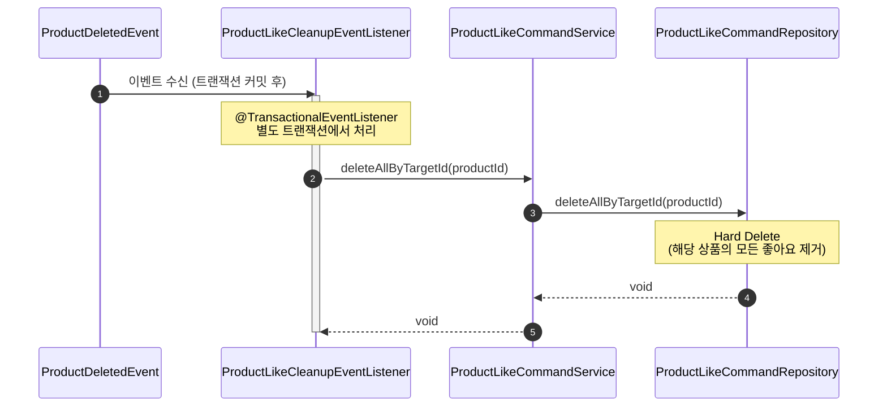

> BrandLike 정리: `BrandDeletedEvent` → `BrandLikeCleanupEventListener` → `BrandLikeCommandService` — 동일한 흐름.

**해석**:
- `ProductDeletedEvent` 수신 시 `ProductLikeCleanupEventListener`에서 처리, `BrandDeletedEvent` 수신 시 `BrandLikeCleanupEventListener`에서 처리한다.
- **별도 트랜잭션**에서 실행되므로, 핸들러 실패가 원래 삭제 트랜잭션에 영향을 주지 않는다.
- **멱등 핸들러**: 이미 삭제된 좋아요에 대해 재실행해도 부작용이 없다 (deleteAll은 0건 삭제도 정상).

---

## 8. Cart BC

### 8-1. 장바구니 담기 (USER) — 동일 상품 병합 포함

**왜 필요한가**: "동일 상품 추가 시 수량 병합"이라는 Alternative Path를 포함한 장바구니 담기 흐름에서 병합 로직의 책임 위치를 확인한다.
**검증 포인트**: 상품 존재 검증에 Port 사용, 동일 상품 병합 로직 위치, 품절 검증 시점.

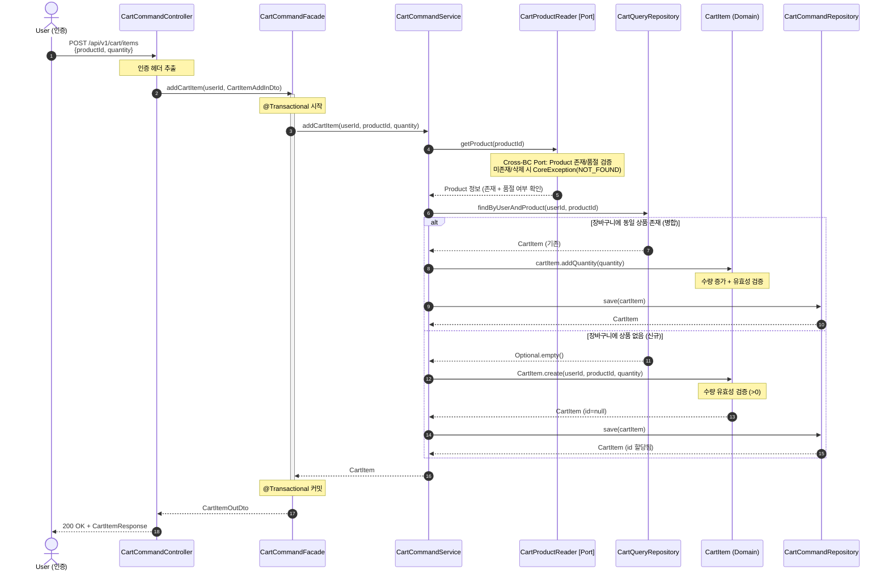

**해석**:
- **Facade는 Service만 호출**한다. 모든 로직(상품 검증, 병합 판단, 저장)은 `CartCommandService` 내부에서 수행된다.
- **Cross-BC 상품 조회는 Port(`CartProductReader`)를 통해** 수행한다. Cart BC에서 Product BC의 Service를 직접 호출하지 않는다.
- **동일 상품 병합 판단은 Service**에서 "조회 후 분기"로 수행한다.
- **수량 증가 로직은 CartItem 도메인 모델**(`addQuantity`)의 책임이다.
- 품절 검증은 상품 조회 시점에서 확인 가능하나, 주문 시점에 재검증이 필요하다 (최종 재고 확인은 Order 생성 시).

---

### 8-2. 장바구니 조회 (USER)

**왜 필요한가**: 간단한 소유권 기반 조회이므로 간략히 표현한다.

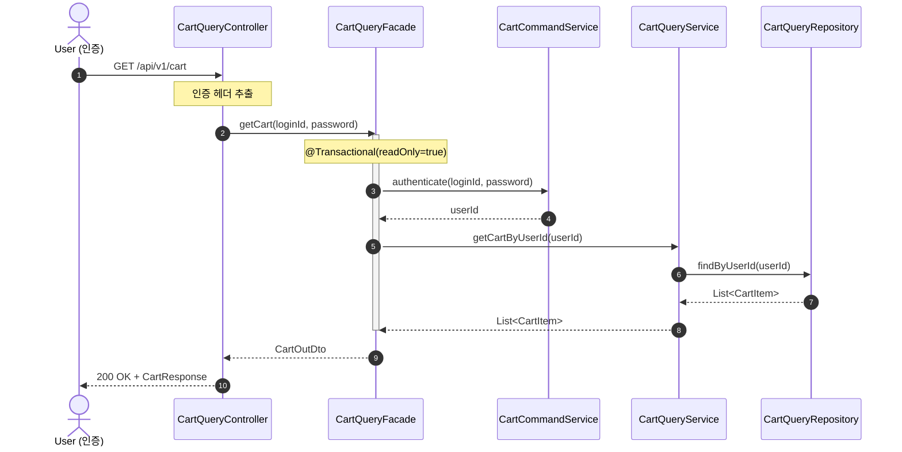

---

### 8-3. 장바구니 수량 변경 (USER)

**왜 필요한가**: 소유권 검증과 도메인 수량 변경 로직의 책임을 확인한다.
**검증 포인트**: 소유권 검증 위치, 수량 0 이하 예외 처리.

```mermaid
sequenceDiagram
    autonumber
    actor User as User (인증)
    participant Controller as CartCommandController
    participant Facade as CartCommandFacade
    participant Service as CartCommandService
    participant QRepo as CartQueryRepository
    participant CRepo as CartCommandRepository
    participant CartItem as CartItem (Domain)

    User->>Controller: PUT /api/v1/cart/items/{cartItemId}<br/>{quantity}
    Note over Controller: 인증 헤더 추출
    Controller->>Facade: updateQuantity(loginId, password, cartItemId, inDto)
    activate Facade
    Note over Facade: @Transactional 시작

    Facade->>Service: authenticate(loginId, password)
    Service-->>Facade: userId

    Facade->>Service: updateQuantity(cartItemId, userId, inDto)
    Service->>QRepo: findById(cartItemId)
    QRepo-->>Service: Optional<CartItem>

    Note over Service: 소유권 검증 (cartItem.userId == userId)<br/>불일치 시 CoreException(CART_ITEM_NOT_FOUND) — 404 마스킹

    Service->>CartItem: cartItem.changeQuantity(quantity)
    Note over CartItem: 수량 유효성 검증 (0 이하 시 예외)
    Service->>CRepo: save(cartItem)
    CRepo-->>Service: CartItem
    Service-->>Facade: CartItem

    Note over Facade: @Transactional 커밋
    Facade-->>Controller: CartItemOutDto
    Controller-->>User: 200 OK + CartItemResponse
    deactivate Facade
```

**해석**:
- **소유권 검증은 Service**에서 수행한다. 타인의 장바구니 항목 접근 시 404를 반환한다 (리소스 존재 노출 방지).
- **수량 유효성 검증은 CartItem 도메인 모델**에서 수행한다 (0 이하 → 예외).

---

### 8-4. 장바구니 항목 삭제 (USER)

```mermaid
sequenceDiagram
    autonumber
    actor User as User (인증)
    participant Controller as CartCommandController
    participant Facade as CartCommandFacade
    participant Service as CartCommandService
    participant QRepo as CartQueryRepository
    participant CRepo as CartCommandRepository

    User->>Controller: DELETE /api/v1/cart/items/{cartItemId}
    Note over Controller: 인증 헤더 추출
    Controller->>Facade: deleteItem(loginId, password, cartItemId)
    activate Facade
    Note over Facade: @Transactional 시작

    Facade->>Service: authenticate(loginId, password)
    Service-->>Facade: userId

    Facade->>Service: deleteItem(cartItemId, userId)
    Service->>QRepo: findById(cartItemId)
    QRepo-->>Service: Optional<CartItem>
    Note over Service: 소유권 검증 (cartItem.userId == userId)<br/>불일치 시 CoreException(CART_ITEM_NOT_FOUND) — 404 마스킹
    Service->>CRepo: delete(cartItem)
    CRepo-->>Service: void
    Service-->>Facade: void

    Note over Facade: @Transactional 커밋
    deactivate Facade
    Facade-->>Controller: void
    Controller-->>User: 204 No Content
```

---

### 8-5. 주문 대상 선택 (USER)

**왜 필요한가**: 장바구니 항목 중 일부/전체를 "선택" 상태로 변경하는 흐름에서, 선택 상태 관리 방식을 확인한다.
**검증 포인트**: 선택 상태의 도메인 모델링 방식, 벌크 업데이트 처리.

```mermaid
sequenceDiagram
    autonumber
    actor User as User (인증)
    participant Controller as CartCommandController
    participant Facade as CartCommandFacade
    participant Service as CartCommandService
    participant QRepo as CartQueryRepository
    participant CRepo as CartCommandRepository
    participant CartItem as CartItem (Domain)

    User->>Controller: PUT /api/v1/cart/items/selection<br/>{cartItemIds: [1, 2, 3]}
    Note over Controller: 인증 헤더 추출
    Controller->>Facade: updateSelection(loginId, password, inDto)
    activate Facade
    Note over Facade: @Transactional 시작

    Facade->>Service: authenticate(loginId, password)
    Service-->>Facade: userId

    Facade->>Service: updateSelection(userId, inDto)
    Service->>QRepo: findByUserId(userId)
    QRepo-->>Service: List<CartItem> (전체)

    loop 각 CartItem
        Service->>CartItem: cartItem.select() 또는 cartItem.deselect()
        Note over CartItem: selectedIds에 포함 → select<br/>미포함 → deselect
        Service->>CRepo: save(item)
        CRepo-->>Service: CartItem
    end
    Service-->>Facade: CartItemSelectionOutDto

    Note over Facade: @Transactional 커밋
    deactivate Facade
    Facade-->>Controller: CartItemSelectionOutDto
    Controller-->>User: 200 OK + CartItemSelectionResponse
```

**해석**:
- 선택/해제는 **CartItem 도메인 모델의 `selected` 필드**를 통해 관리한다.
- 요청에 포함된 ID는 선택, 미포함 ID는 해제 — 이를 통해 전체/부분 선택을 단일 API로 처리한다.

---

### 8-6. 장바구니 상태 확인 (USER)

**왜 필요한가**: 장바구니 상태 응답(total/selected/item 목록) 생성 책임이 어디에 있는지 확인한다.
**검증 포인트**: 사용자별 조회, selected 집계, 상태 DTO 구성 위치.

```mermaid
sequenceDiagram
    autonumber
    actor User as User (인증)
    participant Controller as CartQueryController
    participant Facade as CartQueryFacade
    participant AuthService as CartCommandService
    participant QService as CartQueryService
    participant QRepo as CartQueryRepository

    User->>Controller: GET /api/v1/cart/status
    Note over Controller: 인증 헤더 추출
    Controller->>Facade: getCartStatus(loginId, password)
    activate Facade
    Note over Facade: @Transactional(readOnly=true)

    Facade->>AuthService: authenticate(loginId, password)
    AuthService-->>Facade: userId
    Facade->>QService: getCartStatus(userId)

    QService->>QRepo: findByUserId(userId)
    QRepo-->>QService: List<CartItem>

    Note over QService: selectedCount 집계 + 상태 DTO 변환

    QService-->>Facade: CartStatusOutDto

    deactivate Facade
    Facade-->>Controller: CartStatusOutDto
    Controller-->>User: 200 OK + CartStatusResponse
```

**해석**:
- **Facade는 Service만 호출**한다. 기존처럼 Facade에서 ProductQueryService와 ProductQueryRepository를 직접 호출하지 않는다.
- **장바구니 상태 조회는 Cart BC 내부 조회만 사용**한다. (현재 구현은 상품 재고/삭제 상태와의 Cross-BC 조합 조회를 포함하지 않는다.)
- 상태 응답은 전체 항목 수, 선택 항목 수, 항목별 selected 상태를 기준으로 구성된다.

---

### 8-7. 이벤트 핸들러 — 주문 완료 / 상품 삭제 시 CartItem 정리

**왜 필요한가**: 주문 완료 후 장바구니 항목 정리, 상품 삭제 후 고아 CartItem 정리를 이벤트 기반으로 처리한다. 원래 트랜잭션(주문 생성/상품 삭제)과 분리하여 최종 일관성을 보장한다.
**검증 포인트**: 이벤트별 처리 로직 분리, Hard Delete, 멱등 핸들러.

```mermaid
sequenceDiagram
    autonumber
    participant Event as OrderCreatedEvent / ProductDeletedEvent
    participant Listener as CartEventListener
    participant Service as CartCommandService
    participant Repository as CartCommandRepository

    alt OrderCreatedEvent 수신
        Event->>Listener: OrderCreatedEvent(userId, cartItemIds)
        activate Listener
        Note over Listener: @TransactionalEventListener<br/>별도 트랜잭션에서 처리
        Listener->>Service: deleteAllByUserIdAndIds(userId, cartItemIds)
        Service->>Repository: deleteAllByUserIdAndIds(userId, cartItemIds)
        Note over Repository: Hard Delete<br/>(주문 완료된 장바구니 항목 제거)
        Repository-->>Service: void
        Service-->>Listener: void
        deactivate Listener
    else ProductDeletedEvent 수신
        Event->>Listener: ProductDeletedEvent(productId)
        activate Listener
        Note over Listener: @TransactionalEventListener<br/>별도 트랜잭션에서 처리
        Listener->>Service: deleteAllByProductId(productId)
        Service->>Repository: deleteAllByProductId(productId)
        Note over Repository: Hard Delete<br/>(삭제된 상품의 CartItem 제거)
        Repository-->>Service: void
        Service-->>Listener: void
        deactivate Listener
    end
```

**해석**:
- **OrderCreatedEvent**: 주문이 성공적으로 생성된 후 발행된다. 주문에 포함된 장바구니 항목(`cartItemIds`)을 정리한다. 장바구니 정리 실패가 주문을 무효화하지 않는다.
- **ProductDeletedEvent**: 상품이 Soft Delete된 후 발행된다. 해당 상품이 담긴 모든 CartItem을 정리한다.
- **멱등 핸들러**: 이미 삭제된 항목에 대해 재실행해도 부작용이 없다.

---

## 9. Order BC

### 9-1. 주문 생성 (USER) — 재고 차감 + 스냅샷 + 멱등 키

**왜 필요한가**: P0에서 **가장 복잡한 유스케이스**다. 재고 차감의 원자성, 스냅샷 생성, 멱등 키, 장바구니 정리까지 하나의 트랜잭션에서 어떤 순서로 실행되는지 확인한다.
**검증 포인트**: 멱등 키(`requestId`) 기반 중복 요청 방지, 재고 차감 원자성(부분 차감 금지), 스냅샷 생성 시점, 장바구니 항목 처리 정책, 트랜잭션 범위, 모든 Cross-BC 호출이 Port를 통해 Service 내부에서 수행.

```mermaid
sequenceDiagram
    autonumber
    actor User as User (인증)
    participant Controller as OrderCommandController
    participant Facade as OrderCommandFacade
    participant CheckoutService as OrderCheckoutCommandService
    participant IdemQService as OrderIdempotencyQueryService
    participant OrderQService as OrderQueryService
    participant PlacementService as OrderPlacementCommandService
    participant CartReader as OrderCartItemReader [Port]
    participant ProductReader as OrderProductReader [Port]
    participant StockManager as OrderStockManager [Port]
    participant Order as Order (Domain)
    participant OrderItem as OrderItem (Domain)
    participant OrderRepo as OrderCommandRepository
    participant IdemRepo as IdempotencyKeyCommandRepository
    participant EventPublisher as EventPublisher

    User->>Controller: POST /api/v1/orders<br/>{cartItemIds, requestId}
    Note over Controller: 인증 헤더 추출
    Controller->>Facade: createOrder(loginId, password, OrderCreateInDto)
    activate Facade
    Note over Facade: @Transactional 시작

    Facade->>CheckoutService: authenticate(loginId, password)
    CheckoutService-->>Facade: userId

    %% 1. 멱등 키 확인
    Facade->>IdemQService: findOrderIdByRequestId(userId, requestId)
    alt 이미 처리된 요청
        IdemQService-->>Facade: existingOrderId
        Facade->>OrderQService: findById(existingOrderId)
        OrderQService-->>Facade: Order
        Facade-->>Controller: OrderDetailOutDto
        Controller-->>User: 200 OK (멱등 성공)
    else 신규 요청
        IdemQService-->>Facade: not_found

        %% 2. 장바구니 항목 조회 (Cross-BC Port)
        Facade->>CheckoutService: readCartItemsByIds(userId, cartItemIds)
        CheckoutService->>CartReader: readCartItemsByIds(userId, cartItemIds)
        Note over CartReader: Cross-BC Port: Cart 항목 조회
        CartReader-->>CheckoutService: List<OrderCartItemInfo>
        CheckoutService-->>Facade: List<OrderCartItemInfo>

        %% 3. 상품 조회 (Cross-BC Port)
        Facade->>CheckoutService: readProducts(productIds)
        CheckoutService->>ProductReader: readProducts(productIds)
        Note over ProductReader: Cross-BC Port: Product 정보 조회
        ProductReader-->>CheckoutService: List<OrderProductInfo>
        CheckoutService-->>Facade: List<OrderProductInfo>

        %% 4. 재고 차감 (Cross-BC Port)
        Facade->>CheckoutService: decreaseStocks(cartItems)
        loop productId 오름차순
            CheckoutService->>StockManager: decreaseStock(productId, quantity)
            Note over StockManager: Cross-BC Port: 재고 차감<br/>재고 부족 시 CoreException(INSUFFICIENT_STOCK)<br/>→ 전체 트랜잭션 롤백
        end

        %% 5. 주문 + 주문항목 생성 (스냅샷)
        Facade->>PlacementService: createOrder(userId, requestId, cartItems, products, resolvedCartItemIds)
        PlacementService->>Order: Order.create(userId, totalPrice, orderItems)
        loop 각 CartItem + ProductInfo
            PlacementService->>OrderItem: OrderItem.create(productId,<br/>snapshotName, snapshotPrice, quantity)
            Note over OrderItem: 주문 시점 상품 정보를<br/>스냅샷으로 보존
        end
        PlacementService->>OrderRepo: save(order)
        OrderRepo-->>PlacementService: Order (id 할당됨)

        %% 6. 주문 생성 이벤트 발행 (장바구니 정리는 이벤트로 처리)
        PlacementService->>IdemRepo: save(IdempotencyKey)
        PlacementService->>EventPublisher: publish(OrderCreatedEvent(orderId, userId, cartItemIds))
        Note over EventPublisher: 트랜잭션 커밋 후 발행<br/>→ Cart BC가 구독하여 장바구니 항목 정리 (최종 일관성)

        PlacementService-->>Facade: Order
        Note over Facade: @Transactional 커밋<br/>(재고 차감 + 주문 생성 = 단일 트랜잭션)<br/>장바구니 정리는 이벤트 기반 최종 일관성으로 처리
    end
    deactivate Facade
    Facade-->>Controller: OrderDetailOutDto
    Controller-->>User: 201 Created + OrderDetailResponse
```

**해석**:
- **Facade는 여러 Order Service를 오케스트레이션**한다. (`OrderCheckoutCommandService`, `OrderIdempotencyQueryService`, `OrderPlacementCommandService`, `OrderQueryService`)
- **동기 Cross-BC 호출은 `OrderCheckoutCommandService` 내부 Port 호출로 수행**한다:
  - `OrderCartItemReader`: Cart BC에서 장바구니 항목 조회
  - `OrderProductReader`: Catalog BC에서 상품 정보 조회
  - `OrderStockManager`: Catalog BC에서 재고 차감
- **장바구니 정리는 이벤트 기반 최종 일관성으로 처리**한다:
  - `OrderCreatedEvent`: 트랜잭션 커밋 후 발행 → Cart BC가 구독하여 장바구니 항목 제거
  - 장바구니 정리 실패가 주문을 무효화하지 않는다
- **멱등 키(`requestId`)**: Facade에서 조회(`OrderIdempotencyQueryService`)로 중복 요청을 판별하고, 신규 주문 경로에서는 `OrderPlacementCommandService`가 멱등 키를 저장한다.
- **트랜잭션 원자성이 핵심**: 재고 차감과 주문 생성이 **하나의 트랜잭션** 안에서 수행된다. 어느 하나라도 실패하면 전체 롤백된다.
- **스냅샷은 OrderItem 생성 시점**에 Product의 현재 가격/상품명을 복사하여 저장한다. 이후 상품이 수정/삭제되어도 주문 조회에 영향 없다.
- **동시성 제어**: 재고 차감에 비관적 락(`SELECT ... FOR UPDATE`) 또는 낙관적 락을 적용해야 한다. 락 타임아웃 시 409 Conflict 반환.

> **설계 개선**: 장바구니 정리를 이벤트(`OrderCreatedEvent`)로 분리하여, 주문 트랜잭션의 범위를 축소했다. 재고 차감 + 주문 생성만 동기 트랜잭션으로 보장하고, 장바구니 정리는 최종 일관성으로 처리한다.

---

### 9-2. 주문 목록 조회 (USER)

**왜 필요한가**: 날짜 범위 필터 + 본인 소유 주문만 조회하는 흐름을 확인한다.

```mermaid
sequenceDiagram
    autonumber
    actor User as User (인증)
    participant Controller as OrderQueryController
    participant Facade as OrderQueryFacade
    participant AuthService as OrderCheckoutCommandService
    participant QService as OrderQueryService
    participant Repository as OrderQueryRepository

    User->>Controller: GET /api/v1/orders<br/>?startDate=2026-01-31&endDate=2026-02-10&page=0&size=20
    Note over Controller: 인증 헤더 추출
    Controller->>Facade: getOrders(loginId, password, page, size, startDate, endDate)
    activate Facade
    Note over Facade: @Transactional(readOnly=true)
    Facade->>AuthService: authenticate(loginId, password)
    AuthService-->>Facade: userId
    Facade->>QService: getOrdersByUserId(userId, page, size, startDate, endDate)
    QService->>Repository: findByUserId(userId, startDate, endDate, pageCriteria)
    Repository-->>QService: PageResult<Order>
    QService-->>Facade: OrderPageOutDto
    deactivate Facade
    Facade-->>Controller: OrderPageOutDto
    Controller-->>User: 200 OK + OrderPageResponse
```

---

### 9-3. 주문 상세 조회 (USER) — 스냅샷 기반

**왜 필요한가**: 삭제된 상품이 포함된 주문도 스냅샷으로 정상 조회되는지 확인한다.
**검증 포인트**: 소유권 검증, 스냅샷 기반 조회.

```mermaid
sequenceDiagram
    autonumber
    actor User as User (인증)
    participant Controller as OrderQueryController
    participant Facade as OrderQueryFacade
    participant AuthService as OrderCheckoutCommandService
    participant QService as OrderQueryService
    participant Repository as OrderQueryRepository

    User->>Controller: GET /api/v1/orders/{orderId}
    Note over Controller: 인증 헤더 추출
    Controller->>Facade: getOrder(loginId, password, orderId)
    activate Facade
    Note over Facade: @Transactional(readOnly=true)

    Facade->>AuthService: authenticate(loginId, password)
    AuthService-->>Facade: userId
    Facade->>QService: findByIdAndUserId(orderId, userId)
    QService->>Repository: findById(orderId)
    Repository-->>QService: Order (+ List<OrderItem>)
    QService-->>Facade: Order

    Note over QService: 소유권 검증 (order.userId == userId)<br/>불일치 시 CoreException(ORDER_NOT_FOUND) — 404 마스킹
    Note over Facade: OrderItem의 스냅샷 데이터로 응답 구성<br/>(상품 삭제 여부와 무관)

    deactivate Facade
    Facade-->>Controller: OrderDetailOutDto
    Controller-->>User: 200 OK + OrderDetailResponse
```

**해석**:
- **스냅샷 기반 조회**: `OrderItem`에 저장된 `snapshotName`, `snapshotPrice`를 사용하므로, 원본 Product가 삭제/수정되어도 주문 상세는 정상 조회된다.
- 소유권 검증은 Service에서 수행하며, 타인의 주문 접근 시 404를 반환한다 (리소스 존재 노출 방지).

---

### 9-4. 주문 목록 조회 (ADMIN)

**왜 필요한가**: ADMIN은 userId 필터 없이 전체 주문을 조회한다는 점에서 USER 조회와 다르다.

```mermaid
sequenceDiagram
    autonumber
    actor Admin as Admin (LDAP)
    participant Controller as AdminOrderQueryController
    participant Facade as OrderQueryFacade
    participant Service as OrderQueryService
    participant Repository as OrderQueryRepository

    Admin->>Controller: GET /api-admin/v1/orders?page=0&size=20
    Note over Controller: LDAP 인증 확인
    Controller->>Facade: getAllOrders(page, size)
    activate Facade
    Note over Facade: @Transactional(readOnly=true)
    Facade->>Service: getAllOrders(pageCriteria)
    Service->>Repository: findAll(pageCriteria)
    Repository-->>Service: PageResult<Order>
    Service-->>Facade: PageResult<Order>
    deactivate Facade
    Facade-->>Controller: PageResult<OrderListOutDto>
    Controller-->>Admin: 200 OK + PageResult<AdminOrderListResponse>
```

---

### 9-5. 주문 상세 조회 (ADMIN)

**왜 필요한가**: ADMIN은 소유권 검증 없이 모든 주문 상세를 조회할 수 있다.

```mermaid
sequenceDiagram
    autonumber
    actor Admin as Admin (LDAP)
    participant Controller as AdminOrderQueryController
    participant Facade as OrderQueryFacade
    participant Service as OrderQueryService
    participant Repository as OrderQueryRepository

    Admin->>Controller: GET /api-admin/v1/orders/{orderId}
    Note over Controller: LDAP 인증 확인
    Controller->>Facade: getAdminOrder(orderId)
    activate Facade
    Note over Facade: @Transactional(readOnly=true)
    Facade->>Service: findById(orderId)
    Service->>Repository: findById(orderId)
    Repository-->>Service: Order (+ List<OrderItem>)
    Service-->>Facade: Order
    Note over Facade: 소유권 검증 없음 (ADMIN 권한)
    deactivate Facade
    Facade-->>Controller: OrderDetailOutDto
    Controller-->>Admin: 200 OK + AdminOrderDetailResponse
```

---

## 10. 설계 포인트 요약

### 책임 배치 원칙

| 책임 | 담당 레이어 | 예시 |
|---|---|---|
| 인증 확인 | Controller / Filter | LDAP 인증, 헤더 추출 |
| 트랜잭션 관리 | Facade | `@Transactional` 경계 |
| 유스케이스 오케스트레이션 | Facade | **Service만 호출**, 멱등 판단 |
| 소유권 검증 | Facade / Service (유스케이스별) | `order.userId == userId` 또는 `cartItem.userId == userId` → 불일치 시 404 마스킹 (리소스 존재 노출 방지) |
| 도메인 불변식 (facts 주입형) | Domain Model | `Brand.validateDeletable(hasActiveProducts)` — **Service가 데이터 조회/집계 → Domain Model이 최종 판정** |
| 도메인 협력 중재 규칙 | DomainService | 다중 Aggregate 협력 중재가 필요해질 때 도입 |
| 도메인 불변식 (자체) | Domain Model | `Product.decreaseStock()`, `CartItem.changeQuantity()` |
| 유효성 검증 | Domain Model / VO | `create()` 팩토리 메서드 |
| Cross-BC 통신 (동기) | Port + Adapter | `LikeTargetValidator`, `CartProductReader`, `OrderCartItemReader`, `OrderProductReader`, `OrderStockManager` |
| Cross-BC 통신 (비동기) | EventPublisher + EventListener | `OrderCreatedEvent` → Cart 정리, `ProductDeletedEvent` → Cart/Like 정리, `BrandDeletedEvent` → Like 정리 |
| 멱등 키 | OrderIdempotencyQueryService + IdempotencyKeyCommandRepository | 주문 생성 `requestId` 기반 중복 방지 |
| 영속화 | Repository | CQRS 분리 (Command/Query) |

### 평가기준 정합성 매핑

| 관점 | 평가기준(v1.1) | 설계 문서 합의 | 현재 구현 기준 |
|---|---|---|---|
| 삭제 정책 facts 판정 | 단일 Aggregate 판정은 Entity/VO 허용, facts 준비는 Application | Service가 `existsActiveByBrandId` 조회 후 Domain으로 전달 | `Brand.validateDeletable(hasActiveProducts)` |
| DomainService 도입 조건 | 다중 Aggregate 협력 중재가 필요한 규칙에 한정 | Brand 삭제는 현재 Entity 1차 판정, 필요 시 DomainService 승격 | `BrandDeleteValidator`는 확장 옵션 |
| 해석 충돌 처리 | 책임 경계 충돌 시 `UNDECIDABLE` 우선 후 해석 확정 | 리뷰에서 FAIL 확정 전 질의 | 기준 확정 후 재판정 |

### 잠재 리스크

| 리스크 | 영향 | 완화 방안 |
|---|---|---|
| 주문 생성 트랜잭션 비대화 | Product + Order 2개 도메인이 단일 트랜잭션 | 장바구니 정리를 이벤트(`OrderCreatedEvent`)로 분리하여 완화됨 |
| 재고 차감 동시성 | 동시 주문 시 재고 정합성 문제 | 비관적 락(`FOR UPDATE`) 또는 낙관적 락 + 재시도 |
| Cross-BC Port 증가 | Port/Adapter 수가 늘어나면 유지보수 부담 증가 | Port 인터페이스를 최소한으로 유지, 불필요한 세분화 지양 |
| 이벤트 실패/소실 | 이벤트 핸들러 실패 시 고아 데이터 잔존 가능 | 멱등 핸들러 + 재시도 정책. 고아 데이터는 서비스에 치명적이지 않음 |
| 도메인 책임 경계 해석 차이 | Entity vs DomainService 책임 배치에 대한 문서/리뷰 충돌 가능 | 판정 소유권 기준(단일 Aggregate 판정 vs 협력 중재)을 문서에 고정 |
| 브랜드 삭제 경쟁 상태 | 삭제 직전 상품 등록 시 정합성 깨짐 | 삭제 검증을 비관적 락으로 보호 |
