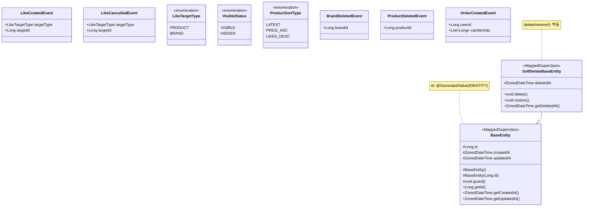
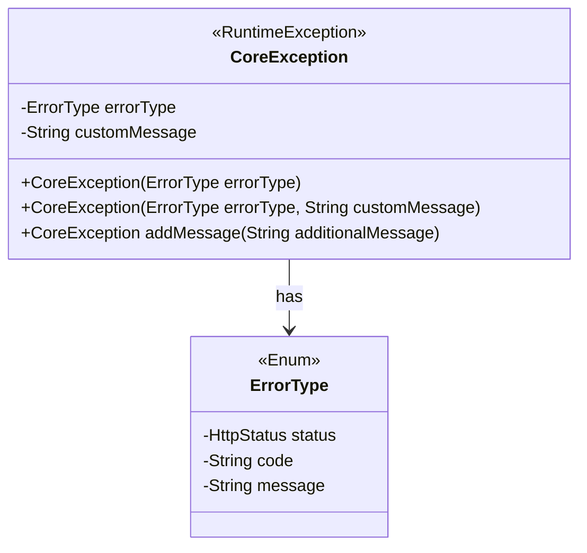
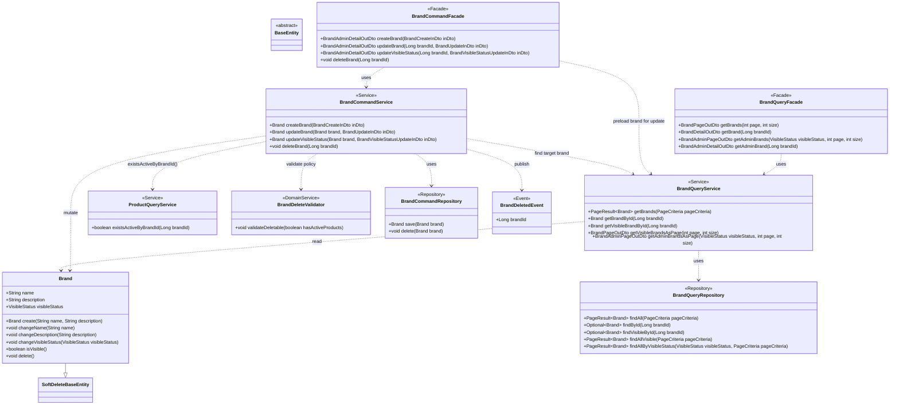
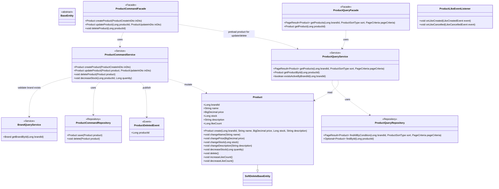
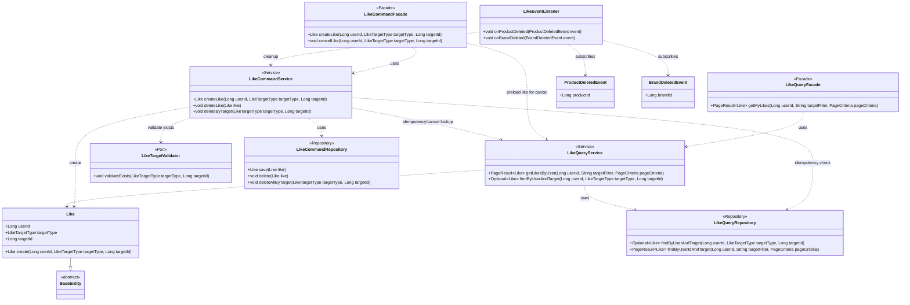
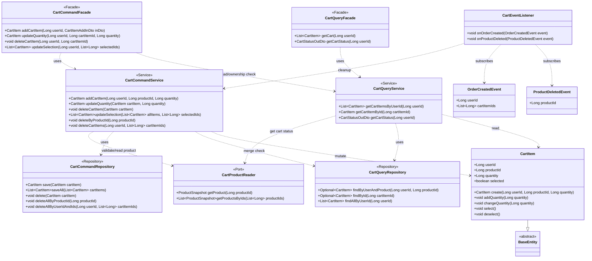

# 클래스 다이어그램 — Slim P0

> 본 문서는 `docs/design/02-sequence-diagrams.md`를 기준으로,
> P0 범위의 도메인 객체 책임과 레이어 의존 방향을 클래스 다이어그램으로 검증한다.
>
> `02-sequence-diagrams.md`에서 상세 속성이 부족한 항목은 `docs/design/01-requirements.md`를 보완 근거로 사용했다.

---

## 목차

1. [문제 상황 재해석](#1-문제-상황-재해석)
2. [클래스 다이어그램 작성 기준](#2-클래스-다이어그램-작성-기준)
3. [공통 모델 (Base/Enum/Event)](#3-공통-모델-baseenumevent)
4. [Catalog BC 클래스 다이어그램](#4-catalog-bc-클래스-다이어그램)
5. [Like BC 클래스 다이어그램](#5-like-bc-클래스-다이어그램)
6. [Cart BC 클래스 다이어그램](#6-cart-bc-클래스-다이어그램)
7. [Order BC 클래스 다이어그램](#7-order-bc-클래스-다이어그램)
8. [Cross-BC Port/Adapter 경계 다이어그램](#8-cross-bc-portadapter-경계-다이어그램)
9. [공개 인터페이스/타입 요약](#9-공개-인터페이스타입-요약)
10. [설계 해석 포인트](#10-설계-해석-포인트)
11. [잠재 리스크 및 확장 포인트](#11-잠재-리스크-및-확장-포인트)

---

## 1. 문제 상황 재해석

### 사용자 관점

- GUEST는 카탈로그를 빠르게 탐색해야 한다.
- USER는 좋아요, 장바구니, 주문으로 이어지는 흐름에서 상태 불일치 없이 작업되어야 한다.
- ADMIN은 브랜드/상품 삭제 정책을 위반하지 않고 운영해야 한다.

### 비즈니스 관점

- 주문 생성 시 재고 차감과 주문 스냅샷 저장이 원자적으로 보장되어야 한다.
- 상품 삭제는 허용하되, 브랜드 삭제는 "활성 상품 0개" 정책을 지켜야 한다.
- 상품 수정/삭제 이후에도 주문 상세는 스냅샷으로 조회 가능해야 한다.

### 시스템 관점

- Query/Command 분리와 BC 경계를 명확히 유지해야 한다.
- Cross-BC 동기 호출은 Port, 후속 정리는 Event로 분리해야 한다.
- 소유권/정책/유효성 검증 책임이 섞이지 않도록 레이어 의존 방향을 고정해야 한다.

---

## 2. 클래스 다이어그램 작성 기준

### 2.1 레이어 의존 규칙

1. Facade는 Service만 호출한다.
2. Service는 Repository, Port, DomainService를 호출한다.
3. DomainService는 Repository/Port를 호출하지 않는다.
4. DomainModel(Entity/VO)은 외부 프레임워크 의존을 갖지 않는다.
5. Domain Entity 간 연관은 단방향 ManyToOne만 허용하며, OneToMany(List/Set) 컬렉션 보유는 금지한다.

### 2.2 표기 범위 (레이어 확장)

- 포함: Entity, VO/Enum, DomainService, Event, Port, Facade, Service, Repository(인터페이스)
- 제외: Controller, Repository 구현체, Framework 인프라 클래스
- 수치 타입 기본값: 금액(`price/totalPrice/snapshotPrice`)은 `BigDecimal`, 수량(`stock/quantity`)은 `Long`으로 표현한다.

### 2.3 검증 목표

- 도메인 책임이 모델 내부에 모여 있는지
- Cross-BC 의존이 Port/Event로만 연결되는지
- 응집도 높은 단위(Brand/Product/Like/Cart/Order)로 분리되어 있는지

---

## 3. 공통 모델 (Base/Enum/Event)

**왜 필요한가**: 모든 BC에서 반복되는 삭제 정책, 타겟 타입, 이벤트 계약을 먼저 고정해야 각 BC 다이어그램을 일관되게 읽을 수 있다.  
**검증 포인트**: Soft/Hard Delete 구분, 이벤트 payload 최소화, 타겟 타입의 다형성 표현.



**해석**:

- `BaseEntity`는 모든 엔티티의 공통 베이스(`id`, `createdAt`, `updatedAt`)이며, `SoftDeleteBaseEntity`가 Soft Delete 전용 기능(`deletedAt`, `delete()`, `restore()`)을 추가한다.
- `LikeCreatedEvent`/`LikeCancelledEvent`는 Product의 likeCount 동기화에 사용된다.
- `LikeTargetType`으로 Like가 Product/Brand 객체에 직접 의존하지 않는다.
- 이벤트는 후속 정리에 필요한 최소 식별자만 담아 BC 결합을 줄인다.

### 3.1 예외 공통 모델

**왜 필요한가**: 도메인 검증 실패가 어떤 공통 타입으로 표현되는지 명시해야 클래스 책임(검증/예외 전파)을 해석할 수 있다.



---

## 4. Catalog BC 클래스 다이어그램

### 4.1 Brand

**왜 필요한가**: 브랜드 생성/수정/삭제와 삭제 정책(활성 상품 0개)의 책임 배치를 명확히 검증해야 한다.  
**검증 포인트**: `BrandDeleteValidator` 사용 위치, Facade -> Service 의존 규칙, Query/Command 분리.



**해석**:

- 브랜드 삭제 정책 검증은 `BrandDeleteValidator`가 담당하고, 필요한 조회는 `BrandCommandService`가 수행한다.
- `updateBrand`는 Facade가 `BrandQueryService`로 대상을 선조회한 뒤, `BrandCommandService.updateBrand(brand, inDto)`를 호출하는 계약으로
  고정했다.
- **`visibleStatus`**: 브랜드 생성 시 기본값 `HIDDEN`. User/Guest API는 `VISIBLE`만 조회, Admin API는 전체 조회 + 필터 옵션.
- **`changeVisibleStatus()`**: null 입력 시 `INVALID_BRAND_VISIBLE_STATUS` 예외. PATCH 전용 엔드포인트 및 PUT 수정에서 선택적 변경.
- **Admin 전용 DTO**: `BrandAdminDetailOutDto`, `BrandAdminPageOutDto` 등 Admin 응답에만 `visibleStatus` 필드 포함.
- Facade는 Service만 사용하며 정책/저장 로직은 Service로 내려간다.
- Brand는 생성/수정/삭제/노출상태 불변식을 가진 Aggregate Root로 유지한다.

### 4.2 Product

**왜 필요한가**: 상품의 핵심 정책(브랜드 참조 고정, 재고 차감, Soft Delete)을 도메인 모델과 레이어 경계에 정확히 반영해야 한다.  
**검증 포인트**: Product가 `brandId`로만 Brand를 참조하는지, 재고 변경 책임이 Product 내부에 있는지.



**해석**:

- Product는 Brand 객체를 직접 참조하지 않고 `brandId`만 보유해 결합을 낮춘다.
- `updateProduct/deleteProduct`는 Facade가 `ProductQueryService`로 대상을 선조회한 뒤 CommandService에 전달하는 계약을 명시했다.
- `decreaseStock()`은 Order 흐름에서도 재사용되는 핵심 도메인 동작이다.
- P0 정책상 Product 삭제는 주문 이력 존재 여부와 독립적으로 허용된다(조회는 스냅샷 기반).

---

## 5. Like BC 클래스 다이어그램

**왜 필요한가**: 좋아요의 멱등성과 대상(Product/Brand) 검증이 어디서 이뤄지는지 명확히 해야 한다.  
**검증 포인트**: `LikeTargetValidator` Port 의존, Like의 타겟 다형성, 이벤트 기반 정리.



**해석**:

- Like는 `targetType + targetId` 구조로 Product/Brand 모델과 분리된다.
- 멱등 등록은 `findByUserAndTarget` 조회 후 분기하는 방식으로 Service에서 보장한다.
- `cancelLike`는 Facade가 QueryService로 대상 Like를 선조회한 뒤 CommandService에 전달하는 흐름으로 고정했다.
- 삭제 이벤트 수신 시 Like BC에서 Hard Delete로 고아 데이터를 정리한다.

---

## 6. Cart BC 클래스 다이어그램

**왜 필요한가**: 장바구니의 병합/선택/수량 변경 규칙을 모델 책임으로 고정하고, 상품 조회를 Port로 분리해야 한다.  
**검증 포인트**: `CartItem` 상태 변경 메서드 응집도, `CartProductReader` 호출 주체(Service), 이벤트 기반 정리.



**해석**:

- 동일 상품 병합은 `findByUserAndProduct` 후 `addQuantity()`로 처리하는 모델 중심 구조다.
- 선택/해제는 `selected` 상태를 가진 CartItem 도메인 동작으로 통일한다.
- `updateQuantity/deleteCartItem/updateSelection`은 Facade가 QueryService 선조회 + 소유권 검증 후 CommandService를 호출하는 구조다.
- 주문 완료 및 상품 삭제 후 정리는 EventListener가 별도 트랜잭션에서 수행한다.

---

## 7. Order BC 클래스 다이어그램

**왜 필요한가**: 재고 차감, 스냅샷 저장, 멱등성 처리를 단일 유스케이스로 묶는 P0 핵심 모델이기 때문이다.  
**검증 포인트**: `OrderItem -> Order` 단방향 ManyToOne(`orderId`) 관계, `IdempotencyService`, Cross-BC Port 의존 집중.

```mermaid
classDiagram
    class BaseEntity {
        <<abstract>>
    }

    class Order {
        +Long userId
        +BigDecimal totalPrice
        +Order create(Long userId)
        +void calculateTotalPrice()
    }
    Order --|> BaseEntity

    class OrderItem {
        +Long orderId
        +Long productId
        +String snapshotName
        +BigDecimal snapshotPrice
        +Long quantity
        +OrderItem create(Long orderId, Long productId, String snapshotName, BigDecimal snapshotPrice, Long quantity)
    }
    OrderItem --|> BaseEntity

    class OrderCommandFacade {
        <<Facade>>
        +Order createOrder(Long userId, OrderCreateInDto inDto)
    }

    class OrderQueryFacade {
        <<Facade>>
        +PageResult~Order~ getMyOrders(Long userId, LocalDate startDate, LocalDate endDate, PageCriteria pageCriteria)
        +Order getMyOrderDetail(Long userId, Long orderId)
        +PageResult~Order~ getAllOrders(PageCriteria pageCriteria)
        +Order getAdminOrderDetail(Long orderId)
    }

    class OrderCommandService {
        <<Service>>
        +Order createOrder(Long userId, OrderCreateInDto inDto)
    }

    class OrderQueryService {
        <<Service>>
        +PageResult~Order~ getOrdersByUserId(Long userId, LocalDate startDate, LocalDate endDate, PageCriteria pageCriteria)
        +PageResult~Order~ getAllOrders(PageCriteria pageCriteria)
        +Order getOrderById(Long orderId)
    }

    class IdempotencyService {
        <<Service>>
        +Optional~Long~ findCompleted(Long userId, String requestId)
        +void markCompleted(Long userId, String requestId, Long orderId)
    }

    class OrderCartItemReader {
        <<Port>>
        +List~CartItemSnapshot~ getCartItems(Long userId, List~Long~ cartItemIds)
    }

    class OrderProductReader {
        <<Port>>
        +List~ProductSnapshot~ getProducts(List~Long~ productIds)
    }

    class OrderStockManager {
        <<Port>>
        +void decreaseStock(Long productId, Long quantity)
    }

    class OrderCommandRepository {
        <<Repository>>
        +Order save(Order order)
    }

    class OrderItemCommandRepository {
        <<Repository>>
        +List~OrderItem~ saveAll(List~OrderItem~ orderItems)
    }

    class OrderQueryRepository {
        <<Repository>>
        +PageResult~Order~ findByUserIdAndDateRange(Long userId, LocalDate startDate, LocalDate endDate, PageCriteria pageCriteria)
        +PageResult~Order~ findAll(PageCriteria pageCriteria)
        +Optional~Order~ findByIdWithItems(Long orderId)
    }

    class OrderCreatedEvent {
        <<Event>>
        +Long userId
        +List~Long~ cartItemIds
    }

    class OrderEventPublisher {
        <<Port>>
        +void publishOrderCreated(Long userId, List~Long~ cartItemIds)
    }

    OrderCommandFacade ..> OrderCommandService : uses
    OrderQueryFacade ..> OrderQueryService : uses

    OrderCommandService ..> IdempotencyService : idempotency
    OrderCommandService ..> OrderCartItemReader : read cart items
    OrderCommandService ..> OrderProductReader : read products
    OrderCommandService ..> OrderStockManager : decrease stock
    OrderCommandService ..> OrderCommandRepository : persist
    OrderCommandService ..> OrderItemCommandRepository : persist items
    OrderCommandService ..> OrderEventPublisher : publish event

    OrderQueryService ..> OrderQueryRepository : read
    OrderCommandService ..> Order : create/mutate
    OrderCommandService ..> OrderItem : create snapshot
    OrderQueryService ..> Order : read

    OrderItem "N" --> "1" Order : orderId
    OrderEventPublisher ..> OrderCreatedEvent : emits
```



**해석**:

- 주문 생성은 `OrderCommandService`에 Port 의존이 집중된 오케스트레이션 구조다.
- `Order`는 `OrderItem` 컬렉션을 보유하지 않고, `OrderItem.orderId`로만 단방향 ManyToOne 관계를 표현한다.
- `OrderItem.snapshot*` 필드가 Product 변경/삭제로부터 주문 조회를 분리한다.
- 멱등성은 `(userId, requestId)` 키를 가진 `IdempotencyService` 계약으로 보장한다.
- USER 주문 상세 조회의 소유권 검증은 `OrderQueryFacade` 관심사로 분리된다.

---

## 8. Cross-BC Port/Adapter 경계 다이어그램

**왜 필요한가**: 각 BC의 의존이 직접 참조가 아닌 Port/Adapter로 연결되는지 한 장에서 검증하기 위해 필요하다.  
**검증 포인트**: Port 구현 주체(Adapter), 이벤트 발행/구독 방향, 동기 호출과 비동기 호출 분리.

```mermaid
classDiagram
    class LikeCommandService
    class CartCommandService
    class CartQueryService
    class OrderCommandService
    class BrandQueryService
    class ProductQueryService
    class ProductCommandService

    class LikeTargetValidator {
        <<Port>>
        +void validateExists(LikeTargetType targetType, Long targetId)
    }
    class CartProductReader {
        <<Port>>
        +ProductSnapshot getProduct(Long productId)
        +List~ProductSnapshot~getProductsByIds(List~Long~ productIds)
    }
    class OrderCartItemReader {
        <<Port>>
        +List~CartItemSnapshot~ getCartItems(Long userId, List~Long~ cartItemIds)
    }
    class OrderProductReader {
        <<Port>>
        +List~ProductSnapshot~getProducts(List~Long~ productIds)
    }
    class OrderStockManager {
        <<Port>>
        +void decreaseStock(Long productId, Long quantity)
    }

    class CatalogLikeTargetValidatorAdapter
    class CatalogCartProductReaderAdapter
    class CartOrderCartItemReaderAdapter
    class CatalogOrderProductReaderAdapter
    class CatalogOrderStockManagerAdapter

    class CatalogDomainEventPublisher
    class OrderDomainEventPublisher

    class BrandDeletedEvent
    class ProductDeletedEvent
    class OrderCreatedEvent

    class LikeEventListener
    class CartEventListener

    LikeCommandService ..> LikeTargetValidator: sync port
    CartCommandService ..> CartProductReader: sync port
    CartQueryService ..> CartProductReader: sync port
    OrderCommandService ..> OrderCartItemReader: sync port
    OrderCommandService ..> OrderProductReader: sync port
    OrderCommandService ..> OrderStockManager: sync port
    CatalogLikeTargetValidatorAdapter ..|> LikeTargetValidator
    CatalogCartProductReaderAdapter ..|> CartProductReader
    CartOrderCartItemReaderAdapter ..|> OrderCartItemReader
    CatalogOrderProductReaderAdapter ..|> OrderProductReader
    CatalogOrderStockManagerAdapter ..|> OrderStockManager
    CatalogLikeTargetValidatorAdapter ..> BrandQueryService: validateExists(BRAND)
    CatalogLikeTargetValidatorAdapter ..> ProductQueryService: validateExists(PRODUCT)
    CatalogCartProductReaderAdapter ..> ProductQueryService: getProduct/getProductsByIds
    CartOrderCartItemReaderAdapter ..> CartQueryService: getCartItems
    CatalogOrderProductReaderAdapter ..> ProductQueryService: getProducts
    CatalogOrderStockManagerAdapter ..> ProductCommandService: decreaseStock
    CatalogDomainEventPublisher ..> BrandDeletedEvent: emits
    CatalogDomainEventPublisher ..> ProductDeletedEvent: emits
    OrderDomainEventPublisher ..> OrderCreatedEvent: emits
    LikeEventListener ..> BrandDeletedEvent: subscribes
    LikeEventListener ..> ProductDeletedEvent: subscribes
    CartEventListener ..> ProductDeletedEvent: subscribes
    CartEventListener ..> OrderCreatedEvent: subscribes
```



**해석**:

- 동기 Cross-BC 호출은 Port 인터페이스를 경계로 하여 컴파일 의존을 역전한다.
- Adapter가 실제 Provider Service(`BrandQueryService`, `ProductQueryService`, `CartQueryService`, `ProductCommandService`)를
  호출하는 종착점을 명시해 의존 방향 검증을 강화했다.
- 비동기 정리 로직은 EventListener가 구독하므로 원 트랜잭션과 결합되지 않는다.
- Port 수가 늘어나도 BC 직접 의존을 막아 경계 안정성을 유지할 수 있다.

---

## 9. 공개 인터페이스/타입 요약

| 분류            | 이름                     | 책임                                |
|---------------|------------------------|-----------------------------------|
| Port          | `LikeTargetValidator`  | Like 대상(Brand/Product) 존재 검증      |
| Port          | `CartProductReader`    | Cart 상태/추가 시 Product 정보 조회        |
| Port          | `OrderCartItemReader`  | 주문 대상 CartItem 조회                 |
| Port          | `OrderProductReader`   | 주문용 Product 정보 조회                 |
| Port          | `OrderStockManager`    | 주문 시 재고 차감                        |
| Port          | `OrderEventPublisher`  | 주문 완료 이벤트(`OrderCreatedEvent`) 발행 |
| DomainService | `BrandDeleteValidator` | 브랜드 삭제 정책(활성 상품 0개) 검증            |
| Event         | `BrandDeletedEvent`    | 브랜드 삭제 후 Like 정리 트리거              |
| Event         | `ProductDeletedEvent`  | 상품 삭제 후 Like/Cart 정리 트리거          |
| Event         | `OrderCreatedEvent`    | 주문 생성 후 Cart 정리 트리거               |
| Idempotency   | `IdempotencyService`   | `(userId, requestId)` 기반 중복 주문 방지 |

### 9.1 이벤트-구독 매핑

| 이벤트                   | 발행 BC   | 구독 Listener         | 처리 내용                      |
|-----------------------|---------|---------------------|----------------------------|
| `OrderCreatedEvent`   | Order   | `CartEventListener` | 주문 포함 CartItem Hard Delete |
| `ProductDeletedEvent` | Catalog | `CartEventListener` | 해당 상품 CartItem Hard Delete |
| `ProductDeletedEvent` | Catalog | `LikeEventListener` | 해당 상품 Like Hard Delete     |
| `BrandDeletedEvent`   | Catalog | `LikeEventListener` | 해당 브랜드 Like Hard Delete    |

### 9.2 이벤트 처리 트랜잭션 규약

```java
@TransactionalEventListener(phase = AFTER_COMMIT)
@Transactional(propagation = REQUIRES_NEW)
```

- 리스너는 별도 트랜잭션에서 실행되어 원 트랜잭션(주문/삭제)에 영향 주지 않는다.
- `deleteAll` 기반 정리 로직은 0건 삭제도 정상 처리되어 멱등성을 유지한다.

---

## 10. 설계 해석 포인트

1. **도메인 책임 중심**: 수량 변경/재고 차감/삭제 같은 핵심 규칙은 Entity 메서드로 유지한다.
2. **의존 방향 고정**: Facade -> Service -> Repository/Port/DomainService 방향으로만 흐른다.
3. **Cross-BC 분리**: 동기는 Port, 후속 정리는 Event로 분리해 결합도와 트랜잭션 부담을 낮춘다.
4. **스냅샷 보존**: 주문 조회는 Product 현재 상태가 아닌 `OrderItem.snapshot*` 기준으로 동작한다.
5. **정책 변경 여지**: P2 확장 시 Product 삭제 정책 강화나 주문 상태 전이를 독립적으로 도입할 수 있다.

---

## 11. 잠재 리스크 및 확장 포인트

| 리스크                       | 영향                     | 선택지                                                |
|---------------------------|------------------------|----------------------------------------------------|
| 주문 생성 Service의 오케스트레이션 집중 | 클래스 복잡도 증가             | A) 서비스 분해(재고/스냅샷) B) 현 구조 유지 + 테스트 강화              |
| Port/Adapter 증가           | 학습 비용 증가               | A) 포트 통합 B) 포트 유지 + 네이밍 규칙 엄격화                     |
| 이벤트 핸들러 실패                | 고아 Like/CartItem 잔존 가능 | A) 재시도 큐 도입 B) 배치 정리 작업 도입                         |
| 브랜드 삭제 경쟁 상태              | 삭제 직전 상품 추가로 정책 위반 가능  | A) 비관적 락 B) 재검증 + 재시도 정책                           |
| P2 정책 확장(주문 상태/옵션)        | 현재 모델 확장 비용 발생         | A) OrderStatus/Option 모델 선반영 B) P0 단순성 유지 후 단계적 확장 |
