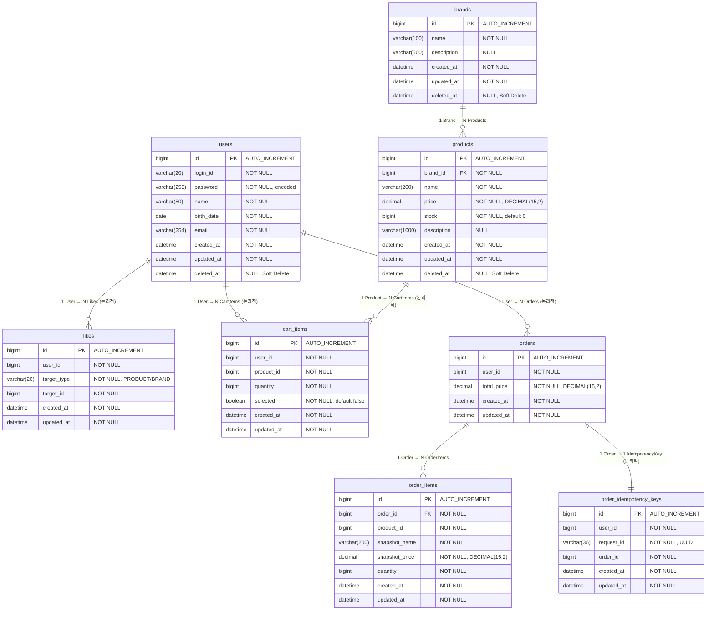

# ERD — Slim P0

> 본 문서는 `01-requirements-v2.md`, `02-sequence-diagrams.md`, `03-class-diagram.md`를 기반으로,
> P0 범위의 **전체 테이블 구조와 관계**를 ERD로 정리한다.
>
> 설계 원칙: **데이터 정합성 우선** — FK 제약, 유니크 제약, 인덱스 설계에서 정합성을 보장하는 구조를 선택한다.

---

## 목차

1. [ERD 작성 목적 및 검증 포인트](#1-erd-작성-목적-및-검증-포인트)
2. [테이블 설계 기준](#2-테이블-설계-기준)
3. [전체 ERD](#3-전체-erd)
4. [BC별 테이블 상세](#4-bc별-테이블-상세)
   - 4.1 User BC — `users`
   - 4.2 Catalog BC — `brands`, `products`
   - 4.3 Like BC — `likes`
   - 4.4 Cart BC — `cart_items`
   - 4.5 Order BC — `orders`, `order_items`, `order_idempotency_keys`
5. [인덱스 · 제약 설계](#5-인덱스-설계)
   - 5.1 유니크 인덱스
   - 5.2 조회 성능 인덱스
   - 5.3 CHECK 제약 요약
6. [데이터 정합성 설계 결정](#6-데이터-정합성-설계-결정)
   - 6.1 FK 경계와 Cross-BC 정합성
   - 6.2 멱등성 보장 레벨
   - 6.3 재고 차감 동시성
   - 6.4 트랜잭션 정합성 체크
7. [삭제 정책과 테이블 매핑](#7-삭제-정책과-테이블-매핑)
8. [잠재 리스크](#8-잠재-리스크)

---

## 1. ERD 작성 목적 및 검증 포인트

### 왜 필요한가

시퀀스/클래스 다이어그램은 **흐름과 책임**을 검증했다. ERD는 **영속성 구조**를 검증한다.
도메인 모델이 DB에 어떤 형태로 저장되고, 테이블 간 관계가 어떻게 정합성을 보장하는지를 이 문서에서 확인한다.

### 검증 포인트

- **관계의 주인**: FK를 누가 보유하는가
- **정규화 여부**: 스냅샷 필드의 의도적 비정규화가 어디서 발생하는가
- **유니크 제약**: 멱등성/중복 방지를 DB 레벨에서 보장하는가
- **Soft Delete vs Hard Delete**: `deleted_at` 유무로 삭제 정책이 테이블에 반영되는가
- **Cross-BC 참조**: FK를 걸지 않는 논리적 참조를 어디서 허용하는가

---

## 2. 테이블 설계 기준

### 2.1 공통 컬럼 (BaseEntity)

| 컬럼 | 타입 | 제약 | 설명 |
|------|------|------|------|
| `id` | BIGINT | PK, AUTO_INCREMENT | 식별자 |
| `created_at` | DATETIME(6) | NOT NULL | 생성 시각 (UTC) |
| `updated_at` | DATETIME(6) | NOT NULL | 수정 시각 (UTC) |
| `deleted_at` | DATETIME(6) | NULL | Soft Delete 대상에만 존재 |

> `deleted_at`은 Soft Delete를 사용하는 테이블(`users`, `brands`, `products`)에만 포함된다.
> Hard Delete 테이블(`likes`, `cart_items`)과 삭제 불가 테이블(`orders`, `order_items`)에는 포함하지 않는다.

### 2.2 FK 제약 원칙

| 관계 유형 | FK 적용 | 근거 |
|-----------|---------|------|
| 같은 BC 내부 | O (FK 적용) | `products.brand_id → brands.id`, `order_items.order_id → orders.id` |
| Cross-BC 참조 | X (FK 미적용) | `likes.target_id`, `cart_items.product_id`, `orders.user_id` 등. 애플리케이션 레벨에서 Port/Adapter로 정합성 보장 |

### 2.3 수치 타입 기준

| 대상 | 타입 | 근거 |
|------|------|------|
| 금액 (`price`, `total_price`, `snapshot_price`) | DECIMAL(15,2) | 소수점 정밀도 보장, 통화 계산 오류 방지 |
| 수량 (`stock`, `quantity`) | BIGINT | 정수 단위 관리 |

---

## 3. 전체 ERD

### 왜 이 구조인가

- **BC 경계 = FK 경계**: 같은 BC 내부만 FK로 연결하여, BC 간 결합도를 DB 레벨에서도 분리한다.
- **스냅샷 비정규화**: `order_items`는 주문 시점 상품 정보를 복제하여, 상품 변경/삭제와 무관하게 조회를 보장한다.
- **멱등성 테이블**: `order_idempotency_keys`로 주문 중복 생성을 DB 레벨에서 차단한다.



### 해석 포인트

1. **실선 관계 (FK)**: `brands ↔ products`, `orders ↔ order_items`만 물리적 FK를 가진다. 같은 BC 내부이므로 DB 레벨에서 참조 무결성을 보장한다.
2. **점선 관계 (논리적 참조)**: `likes.user_id`, `cart_items.product_id`, `orders.user_id` 등은 FK 없이 애플리케이션 레벨(Port/Adapter)에서 정합성을 검증한다.
3. **`deleted_at` 유무**: Soft Delete 대상(`users`, `brands`, `products`)에만 존재하며, Hard Delete/삭제 불가 테이블에는 없다.

---

## 4. BC별 테이블 상세

### 4.1 User BC — `users`

> 이미 구현된 테이블. 인증/계정은 설계 범위 외이므로 현재 구조를 그대로 유지한다.

| 컬럼 | 타입 | 제약 | 설명 |
|------|------|------|------|
| `id` | BIGINT | PK, AUTO_INCREMENT | |
| `login_id` | VARCHAR(20) | NOT NULL | 로그인 ID (trim + lowercase 정규화) |
| `password` | VARCHAR(255) | NOT NULL | 인코딩된 비밀번호 (SHA-256) |
| `name` | VARCHAR(50) | NOT NULL | 이름 |
| `birth_date` | DATE | NOT NULL | 생년월일 |
| `email` | VARCHAR(254) | NOT NULL | 이메일 |
| `created_at` | DATETIME(6) | NOT NULL | |
| `updated_at` | DATETIME(6) | NOT NULL | |
| `deleted_at` | DATETIME(6) | NULL | Soft Delete |

---

### 4.2 Catalog BC — `brands`, `products`

#### `brands`

| 컬럼 | 타입 | 제약 | 설명 |
|------|------|------|------|
| `id` | BIGINT | PK, AUTO_INCREMENT | |
| `name` | VARCHAR(100) | NOT NULL | 브랜드명 |
| `description` | VARCHAR(500) | NULL | 브랜드 설명 |
| `created_at` | DATETIME(6) | NOT NULL | |
| `updated_at` | DATETIME(6) | NOT NULL | |
| `deleted_at` | DATETIME(6) | NULL | Soft Delete |

#### `products`

| 컬럼 | 타입 | 제약 | 설명 |
|------|------|------|------|
| `id` | BIGINT | PK, AUTO_INCREMENT | |
| `brand_id` | BIGINT | NOT NULL, **FK → brands(id)** | 소속 브랜드 |
| `name` | VARCHAR(200) | NOT NULL | 상품명 |
| `price` | DECIMAL(15,2) | NOT NULL, CHECK(price >= 0) | 가격 |
| `stock` | BIGINT | NOT NULL, DEFAULT 0, CHECK(stock >= 0) | 재고 수량 |
| `description` | VARCHAR(1000) | NULL | 상품 설명 |
| `created_at` | DATETIME(6) | NOT NULL | |
| `updated_at` | DATETIME(6) | NOT NULL | |
| `deleted_at` | DATETIME(6) | NULL | Soft Delete |

**FK 설계 결정**:
- `products.brand_id → brands.id`: 같은 Catalog BC 내부이므로 FK를 적용한다.
- `ON DELETE RESTRICT`: 브랜드 삭제는 Soft Delete이므로 물리적 CASCADE가 불필요하다. 만약 실수로 Hard Delete를 시도하면 FK가 차단한다.

---

### 4.3 Like BC — `likes`

| 컬럼 | 타입 | 제약 | 설명 |
|------|------|------|------|
| `id` | BIGINT | PK, AUTO_INCREMENT | |
| `user_id` | BIGINT | NOT NULL | 좋아요한 사용자 (Cross-BC, FK 없음) |
| `target_type` | VARCHAR(20) | NOT NULL, CHECK(target_type IN ('PRODUCT','BRAND')) | 대상 유형 |
| `target_id` | BIGINT | NOT NULL | 대상 리소스 ID |
| `created_at` | DATETIME(6) | NOT NULL | |
| `updated_at` | DATETIME(6) | NOT NULL | |

**`deleted_at` 미포함**: Hard Delete 대상. 이벤트(`ProductDeletedEvent`, `BrandDeletedEvent`) 수신 시 물리 삭제된다.

**유니크 제약**: `UNIQUE(user_id, target_type, target_id)` — 동일 사용자가 동일 대상에 중복 좋아요를 DB 레벨에서 차단한다.

**FK 미적용 근거**:
- `user_id → users.id`: User BC와 Like BC는 다른 BC이므로 FK를 걸지 않는다.
- `target_id`: 다형적 참조(PRODUCT/BRAND)이므로 단일 FK 설정이 불가능하다.

---

### 4.4 Cart BC — `cart_items`

| 컬럼 | 타입 | 제약 | 설명 |
|------|------|------|------|
| `id` | BIGINT | PK, AUTO_INCREMENT | |
| `user_id` | BIGINT | NOT NULL | 소유 사용자 (Cross-BC, FK 없음) |
| `product_id` | BIGINT | NOT NULL | 담긴 상품 (Cross-BC, FK 없음) |
| `quantity` | BIGINT | NOT NULL, CHECK(quantity > 0) | 수량 |
| `selected` | BOOLEAN | NOT NULL, DEFAULT FALSE | 주문 대상 선택 여부 |
| `created_at` | DATETIME(6) | NOT NULL | |
| `updated_at` | DATETIME(6) | NOT NULL | |

**`deleted_at` 미포함**: Hard Delete 대상. 주문 완료 시(`OrderCreatedEvent`) 또는 상품 삭제 시(`ProductDeletedEvent`) 물리 삭제된다.

**유니크 제약**: `UNIQUE(user_id, product_id)` — 동일 사용자가 동일 상품을 중복 라인으로 담는 것을 차단한다. 동일 상품 재추가 시 수량 병합(addQuantity)을 강제한다.

**FK 미적용 근거**:
- `user_id → users.id`: Cross-BC (Cart ↔ User)
- `product_id → products.id`: Cross-BC (Cart ↔ Catalog). 상품 삭제 시 이벤트 기반 Hard Delete로 정리된다.

---

### 4.5 Order BC — `orders`, `order_items`, `order_idempotency_keys`

#### `orders`

| 컬럼 | 타입 | 제약 | 설명 |
|------|------|------|------|
| `id` | BIGINT | PK, AUTO_INCREMENT | |
| `user_id` | BIGINT | NOT NULL | 주문자 (Cross-BC, FK 없음) |
| `total_price` | DECIMAL(15,2) | NOT NULL | 주문 총액 |
| `created_at` | DATETIME(6) | NOT NULL | |
| `updated_at` | DATETIME(6) | NOT NULL | |

**`deleted_at` 미포함**: 삭제 불가. P0에서 주문 삭제 API는 제공하지 않는다.

#### `order_items`

| 컬럼 | 타입 | 제약 | 설명 |
|------|------|------|------|
| `id` | BIGINT | PK, AUTO_INCREMENT | |
| `order_id` | BIGINT | NOT NULL, **FK → orders(id)** | 소속 주문 |
| `product_id` | BIGINT | NOT NULL | 원본 상품 ID (참조용, FK 없음) |
| `snapshot_name` | VARCHAR(200) | NOT NULL | 주문 시점 상품명 (스냅샷) |
| `snapshot_price` | DECIMAL(15,2) | NOT NULL, CHECK(snapshot_price >= 0) | 주문 시점 가격 (스냅샷) |
| `quantity` | BIGINT | NOT NULL, CHECK(quantity > 0) | 주문 수량 |
| `created_at` | DATETIME(6) | NOT NULL | |
| `updated_at` | DATETIME(6) | NOT NULL | |

**의도적 비정규화 — 스냅샷 필드**:
- `snapshot_name`, `snapshot_price`: 주문 시점의 상품 정보를 복제하여 저장한다.
- 원본 상품(`products`)이 수정/삭제되더라도, 과거 주문 조회는 스냅샷 기반으로 정상 동작한다.
- `product_id`는 "현재 상품 페이지 이동" 등 참조용으로만 보유하며 FK를 걸지 않는다.

**FK 설계 결정**:
- `order_items.order_id → orders.id`: 같은 Order BC 내부이므로 FK를 적용한다.
- `ON DELETE RESTRICT`: 주문은 삭제 불가이므로 CASCADE 불필요. 실수 방지용.

#### `order_idempotency_keys`

| 컬럼 | 타입 | 제약 | 설명 |
|------|------|------|------|
| `id` | BIGINT | PK, AUTO_INCREMENT | |
| `user_id` | BIGINT | NOT NULL | 요청 사용자 |
| `request_id` | VARCHAR(36) | NOT NULL | 클라이언트 발급 UUID |
| `order_id` | BIGINT | NOT NULL | 생성된 주문 ID |
| `created_at` | DATETIME(6) | NOT NULL | |
| `updated_at` | DATETIME(6) | NOT NULL | |

**유니크 제약**:
- `UNIQUE(user_id, request_id)` — 동일 사용자의 동일 요청 ID로 중복 주문 생성을 DB 레벨에서 차단한다.
- `UNIQUE(order_id)` — 한 주문에 멱등 키가 1개만 연결되는 규칙을 DB 레벨에서 보장한다.

**TTL 고려 사항**: `order_idempotency_keys`는 시간이 지나면 만료되어야 한다. P0에서는 배치 정리(예: 30일 경과 레코드 삭제)를 고려할 수 있으나, 우선순위는 낮다.

---

## 5. 인덱스 설계

### 5.1 유니크 인덱스 (정합성 보장)

| 테이블 | 인덱스 | 컬럼 | 용도 |
|--------|--------|------|------|
| `likes` | `uk_likes_user_target` | `(user_id, target_type, target_id)` | 좋아요 중복 방지 (멱등성) |
| `cart_items` | `uk_cart_items_user_product` | `(user_id, product_id)` | 동일 상품 중복 라인 방지 (병합 강제) |
| `order_idempotency_keys` | `uk_order_idempotency_user_request` | `(user_id, request_id)` | 주문 중복 생성 방지 (멱등성) |
| `order_idempotency_keys` | `uk_order_idempotency_order` | `(order_id)` | 1 주문 : 1 멱등키 보장 |

### 5.2 조회 성능 인덱스 (쿼리 패턴 반영 복합 인덱스)

| 테이블 | 인덱스 | 컬럼 | 용도 (쿼리 패턴) |
|--------|--------|------|------|
| `products` | `idx_products_brand_deleted_id` | `(brand_id, deleted_at, id DESC)` | 브랜드별 활성 상품 목록 (커서 페이징) |
| `products` | `idx_products_deleted_price_id` | `(deleted_at, price, id DESC)` | 활성 상품 가격순 조회 (커서 페이징) |
| `products` | `idx_products_deleted_id` | `(deleted_at, id DESC)` | 활성 상품 전체 목록 (커서 페이징) |
| `likes` | `idx_likes_user_type_id` | `(user_id, target_type, id DESC)` | 사용자별 타겟 유형 필터 좋아요 목록 |
| `likes` | `idx_likes_target` | `(target_type, target_id)` | 이벤트 수신 시 대상별 좋아요 삭제 |
| `cart_items` | `idx_cart_items_user_id` | `(user_id, id DESC)` | 사용자별 장바구니 조회 (정렬 포함) |
| `cart_items` | `idx_cart_items_product_id` | `(product_id)` | 이벤트 수신 시 상품별 CartItem 삭제 |
| `orders` | `idx_orders_user_created` | `(user_id, created_at DESC)` | 사용자별 주문 목록 (최신순) |
| `orders` | `idx_orders_created` | `(created_at DESC)` | 관리자 전체 주문 조회 (최신순) |
| `order_items` | `idx_order_items_order_id` | `(order_id, id)` | 주문별 주문 항목 조회 (정렬 포함) |

### 5.3 CHECK 제약 요약

| 테이블 | 제약 | 목적 |
|--------|------|------|
| `products` | `CHECK(price >= 0)` | 음수 가격 방지 |
| `products` | `CHECK(stock >= 0)` | 음수 재고 방지 (재고 차감 시 DB 레벨 안전망) |
| `cart_items` | `CHECK(quantity > 0)` | 0 이하 수량 방지 |
| `order_items` | `CHECK(quantity > 0)` | 0 이하 주문 수량 방지 |
| `order_items` | `CHECK(snapshot_price >= 0)` | 음수 스냅샷 가격 방지 |
| `likes` | `CHECK(target_type IN ('PRODUCT','BRAND'))` | 허용된 대상 유형만 저장 |

> CHECK 제약은 애플리케이션 레벨 검증의 **최종 방어선**이다. 도메인 모델에서 1차 검증하고, DB CHECK가 잘못된 데이터 유입을 원천 차단한다.

---

## 6. 데이터 정합성 설계 결정

### 6.1 FK 경계와 Cross-BC 정합성

```
┌─────────────────┐     FK     ┌──────────────────┐
│     brands      │◄──────────│    products       │ 같은 Catalog BC: FK 적용
└─────────────────┘            └──────────────────┘

┌─────────────────┐     FK     ┌──────────────────┐
│     orders      │◄──────────│   order_items     │ 같은 Order BC: FK 적용
└─────────────────┘            └──────────────────┘

┌─────────────────┐  논리적 참조  ┌──────────────────┐
│     users       │◁ ─ ─ ─ ─ ─│ likes/cart/orders │ Cross-BC: FK 미적용
└─────────────────┘            └──────────────────┘
                                   App 레벨 검증
```

- **같은 BC 내부**: DB FK로 참조 무결성을 강제한다. 잘못된 삭제/참조를 원천 차단한다.
- **Cross-BC**: FK를 걸지 않되, 애플리케이션 레벨에서 Port/Adapter 패턴으로 검증한다. BC 간 독립 배포/스키마 진화를 보장한다.

### 6.2 멱등성 보장 레벨

| 대상 | DB 레벨 | App 레벨 | 설명 |
|------|---------|---------|------|
| 좋아요 등록 | UNIQUE 제약 | Service 조회 후 분기 | DB가 최종 방어선, App이 1차 판단 |
| 장바구니 동일 상품 | UNIQUE 제약 | Service 조회 후 병합 | DB가 최종 방어선, App이 병합 로직 |
| 주문 생성 | UNIQUE 제약 (`order_idempotency_keys`) | IdempotencyService 조회 | DB가 최종 방어선, App이 1차 판단 |
| 좋아요 취소/삭제 | — | 미등록 시 404 반환 | 삭제는 멱등 아닌 404 반환 정책 |

### 6.3 재고 차감 동시성

`products.stock` 필드에 대한 동시 차감은 **비관적 락(`SELECT ... FOR UPDATE`)**으로 보장한다.

```sql
-- 재고 차감 시 행 수준 락
SELECT id, stock FROM products WHERE id = ? FOR UPDATE;
-- stock >= quantity 확인 후
UPDATE products SET stock = stock - ?, updated_at = NOW() WHERE id = ?;
```

- All-or-Nothing: 한 주문 내 모든 상품의 재고 차감이 단일 트랜잭션에서 수행된다.
- 재고 부족 시 전체 롤백, 부분 차감 없음.

### 6.4 트랜잭션 정합성 체크

각 핵심 유스케이스에서 데이터 정합성이 어떻게 보장되는지 정리한다.

#### 주문 생성 (단일 트랜잭션)

```
BEGIN TX
  1. 멱등키 조회 (order_idempotency_keys) → 이미 존재하면 기존 주문 반환
  2. 재고 차감 (products — SELECT FOR UPDATE → stock 감소)
  3. 주문 저장 (orders + order_items INSERT)
  4. 멱등키 기록 (order_idempotency_keys INSERT)
COMMIT
→ 실패 시 전체 롤백 (재고 원복, 주문 미생성, 멱등키 미기록)
```

- **All-or-Nothing**: 재고 차감 · 주문 생성 · 멱등키 기록이 원자적으로 수행된다.
- 재고 부족 시 `CoreException` → 전체 롤백, 부분 차감 없음.

#### 상품 삭제 (Soft Delete + 최종 일관성)

```
BEGIN TX
  1. 상품 Soft Delete (products.deleted_at 설정)
  2. ProductDeletedEvent 발행
COMMIT

@TransactionalEventListener (AFTER_COMMIT)
  3. Cart 정리 — 해당 product_id의 cart_items Hard Delete
  4. Like 정리 — target_type='PRODUCT' AND target_id 해당하는 likes Hard Delete
```

- 상품 삭제 자체는 트랜잭션으로 보장, 후속 정리는 이벤트 기반 **최종 일관성(eventual consistency)**.
- 이벤트 핸들러는 멱등하게 구현하여 재처리에 안전.

#### 브랜드 삭제 (단일 트랜잭션)

```
BEGIN TX
  1. 활성 상품 존재 확인 (DomainService — products WHERE brand_id = ? AND deleted_at IS NULL)
     → 활성 상품 존재 시 CoreException (삭제 불가)
  2. 브랜드 Soft Delete (brands.deleted_at 설정)
  3. BrandDeletedEvent 발행
COMMIT

@TransactionalEventListener (AFTER_COMMIT)
  4. Like 정리 — target_type='BRAND' AND target_id 해당하는 likes Hard Delete
```

- 브랜드 삭제 전 활성 상품 검증은 **DomainService**에서 수행 (Service가 데이터를 조회하여 전달).

---

## 7. 삭제 정책과 테이블 매핑

| 테이블 | 삭제 방식 | `deleted_at` | 근거 |
|--------|-----------|:------------:|------|
| `users` | Soft Delete | O | 향후 복구 가능성, 주문 이력 참조 |
| `brands` | Soft Delete | O | 상품 참조, 이력 보존 |
| `products` | Soft Delete | O | 주문 스냅샷이 `product_id`를 참조 |
| `likes` | Hard Delete | X | 이력 불필요, 타 도메인 미참조 |
| `cart_items` | Hard Delete | X | 임시 데이터, 주문 후 가치 없음 |
| `orders` | 삭제 불가 | X | 영구 기록 |
| `order_items` | 삭제 불가 | X | Order에 종속, 스냅샷 보존 |
| `order_idempotency_keys` | 배치 정리 (P1) | X | TTL 기반 만료 (예: 30일) |

### Soft Delete 조회 필터링

Soft Delete 테이블은 조회 시 `WHERE deleted_at IS NULL` 조건을 기본 적용한다.
- **Repository 기본 조건**: `deleted_at IS NULL` (활성 레코드만 반환)
- **삭제된 레코드 포함 조회**: 관리 목적일 경우 별도 메서드로 제공 가능

---

## 8. 잠재 리스크

| 리스크 | 영향 | 완화 방안 |
|--------|------|----------|
| Cross-BC FK 미적용으로 고아 레코드 발생 가능 | `likes`/`cart_items`가 삭제된 상품/브랜드를 참조 | 이벤트 기반 정리 (`ProductDeletedEvent`, `BrandDeletedEvent`) + 멱등 핸들러 |
| `order_idempotency_keys` 무한 증가 | 디스크 사용량 증가 | TTL 기반 배치 정리 (P1). 30일 경과 레코드 삭제 |
| 다형적 참조 (`likes.target_type + target_id`) | FK 불가, 타입 안전성 낮음 | 애플리케이션 레벨 `LikeTargetType` enum으로 제한. `LikeTargetValidator` Port로 존재 검증 |
| Soft Delete 누적 | 조회 성능 저하 | `deleted_at IS NULL` 조건 인덱스(partial index) 또는 아카이빙 정책 (P2) |
| 재고 비관적 락 대기 | 동시 주문 급증 시 락 타임아웃 | 타임아웃 409 반환 + 클라이언트 재시도. P2에서 분산 락(Redis) 고려 |
| `order_items.product_id` 참조 불일치 | 상품 Hard Delete 시 참조 끊김 | 상품은 Soft Delete이므로 물리 삭제 없음. 스냅샷 필드로 조회 독립 보장 |
